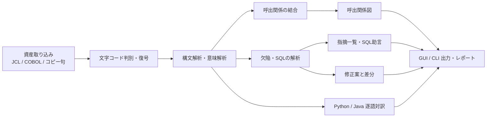
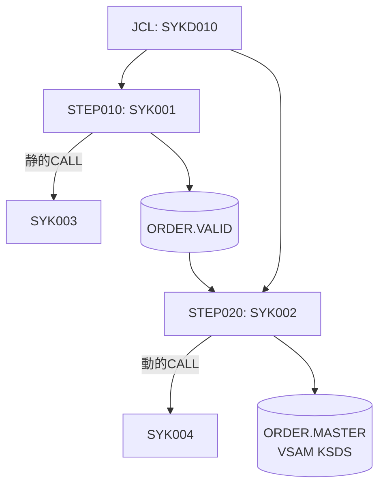

# 01 企画コンセプト

本書は、COBOL資産の静的解析を支援する本アプリケーションの企画コンセプトを定める。目的、対象ユーザー、提供価値と機能概要、動作環境、対象範囲と将来拡張、画面構成案、名称の由来を扱う。名称はCOBOL Insightであり、その由来は第7章で示す。

## 本書の位置づけと関連文書

本アプリケーションの文書一式は次の6冊で構成する。本書は最上流の企画コンセプトを担う。

- `docs/01_企画コンセプト.md`（本書）: 目的・対象ユーザー・提供価値・機能概要・動作環境・画面構成案・名称の由来を定める。
- `docs/02_要件定義.md`: 機能要件・非機能要件・入出力仕様・受入基準を定義する。
- `docs/03_技術選定.md`: コア言語・パーサー・解析基盤・GUI/CLI基盤・永続化の技術構成と採否理由を確定する。
- `docs/04_アーキテクチャ設計.md`: モジュール分割・データモデル・処理パイプライン・拡張機構を設計する。
- `docs/05_開発計画.md`: 開発フェーズ・工数見積り・リスク管理・検証計画を定める。
- `docs/06_ルールカタログ.md`: バグ検出ルール31件とSQL最適化助言ルール6件の正本を定める。

## 1. 目的

本アプリケーションは、COBOLで書かれた既存システム資産の保守・理解・品質改善を支援する静的解析ツールである。ソースを実行せずに解析し、資産の呼出関係、潜在欠陥、埋め込みSQLの改善余地を可視化し、修正案の差分と他言語への逐語対訳を提示する。

背景には、メインフレーム上のCOBOL資産を保守できる要員が減少し、資産の構造や挙動の把握が一部の有識者に依存している事情がある。本アプリケーションは、資産の構造と品質を機械的に可視化し、有識者の暗黙知に頼らず資産を読み解ける状態を作ることを目的とする。

解析から出力までの全体像を次に示す。

## 2. 対象ユーザー

本アプリケーションが想定する利用者は次の3者である。

- **COBOL資産の保守担当者**: 障害調査や機能改修にあたり、修正対象プログラムの呼出元・呼出先とデータの流れを短時間で把握したい担当者。
- **システム移行の調査担当者**: 現行資産の全体像と依存関係を棚卸しし、移行範囲・影響範囲を洗い出す担当者。COBOLの熟練度が高くない場合でも、逐語対訳を手掛かりに現行ロジックを読み解ける。
- **品質管理・レビュー担当者**: 資産の潜在欠陥やSQLの改善余地を機械的に検出し、レビューの網羅性と客観性を高めたい担当者。

## 3. 提供価値と機能概要

本アプリケーションは5つの機能を提供する。いずれの機能も決定論的なルールベースで動作し、同一の入力に対して同一の結果を返す。以下、機能ごとに内容と利用場面を示す。

### 3.1 呼出関係図示（JCL→プログラム→サブルーチン）

JCLのジョブ・ステップ、COBOLプログラム、CALLで呼ぶサブルーチン、入出力データセットを1つの呼出関係図として結合し可視化する。JCLの`EXEC PGM=`とCOBOLの`PROGRAM-ID`を対応づける。静的CALL（呼出先リテラル指定）は呼出先を直接解決する。動的CALL（変数指定）はデータフロー解析で候補を推定する。解決できないCALL先や外部ユーティリティは、種別を明示した専用ノードとして図に表す。ステップ間・ジョブ間のデータセット連携（前ステップの出力を後ステップが入力する関係）も辺として描く。CICSのトランザクション遷移（`XCTL`・`LINK`・`START`・`RETURN TRANSID`による遷移）と、BMSマップの参照関係も、呼出関係図の辺として含める。

利用場面: 移行調査で1本のプログラムに連なる上流のJCLと下流のサブルーチン・データセットを一望し、影響範囲を確定する。保守で修正対象の呼出元をたどり、変更の波及先を確認する。動的CALLや未解決の呼出先を「未解決（動的）」ノードとして明示することで、図の完全性を過大に主張しない。

模擬資産の呼出関係を例に示す。

### 3.2 バグ検出の静的解析

COBOLソースを解析し、実行前に潜在欠陥を検出する。検出は構文解析だけで判定できるものから、制御フロー・データフロー解析を要するものまで段階的に扱う。検出対象の例には、未初期化変数の参照、MOVEでの桁落ち・切り捨て、OCCURS範囲外になり得る添字、ファイルステータス未検査、SQLCODE未検査、PERFORM THRUの範囲へ割り込むGO TO、到達不能コード、使われない変数・段落、ON SIZE ERROR欠如の演算、存在しないBMSマップ・フィールドの参照がある。各指摘には対象ファイル・行番号・欠陥種別・根拠を付す。コードスメルに近い指摘は、欠陥そのものと区別できるよう重大度を下げて提示する。

利用場面: 品質管理・レビューで、目視では見落としやすい潜在欠陥を機械的に洗い出す。保守で改修前後の資産に対して同一基準の検査をかけ、混入した欠陥を早期に発見する。

### 3.3 SQL最適化助言

COBOLソースに埋め込まれたDb2 SQL（`EXEC SQL`〜`END-EXEC`）を抽出し、構文レベルで改善余地を助言する。カーソル宣言、`SELECT INTO`、`UPDATE`、`INSERT`の文を解析対象とする。助言は、データベースのカタログや実行計画に依存しない構文レベルに限定する。助言の生成処理は端末内で完結し、決定論的に動作する。

利用場面: 性能懸念のある埋め込みSQLを棚卸しし、改善候補を一覧で確認する。移行調査でプログラムが触れるDb2表とアクセス方式を把握する。

### 3.4 修正案生成とdiff表示

検出した指摘のうち、修正の形が一意に定まるものについて修正案を生成する。修正案の対象は、ON SIZE ERROR句の付与、FILE STATUS検査の挿入、SQLCODE検査の挿入、CICS応答コード（RESP/RESP2）検査の挿入の4種とする。修正はCOBOL固定形式の桁規則（本体のB領域、継続行、一連番号欄・識別欄）を保ったまま生成する。判断を要する指摘は自動修正の対象とせず、助言にとどめる。

修正案は変更前後のソースを差分（diff）で示す。修正箇所がコピーブックの中にある場合も修正案を提示する。適用の判断と責任は利用者にある。適用しても原本ファイルは書き換えない。修正後のソースは、元の相対パス構成を保った別ディレクトリ（例:`fix/`配下）へ出力する。コピーブックに対する修正案には、それを取り込んでいる全プログラムへ影響が及ぶ旨と対象プログラムの一覧を併せて提示する。

利用場面: 指摘の是正を、抽象的な指示ではなく具体的な差分として確認し、採否を判断する。レビューで修正方針を差分ベースで合意する。

### 3.5 Python/Java逐語対訳

COBOLの各行を、最適化を加えずPythonまたはJavaへ逐語で翻訳する。COBOL行と生成行を1対多・多対1の対応表で結び、画面上で相互にリンクする。PERFORM、GO TO、REDEFINES、COMP-3、88レベル、ファイルI-Oといった構文を対象とする。直訳できない構文は注記を付し、複数のCOBOL行が1行の生成コードに集約される関係を可視化して提示する。

利用場面: COBOLに不慣れな移行調査担当者が、対訳を手掛かりに現行ロジックを読み解く。保守担当者が処理の意図を他言語の語彙で確認する。対訳は理解の補助を目的とし、実行可能なコードへの移行そのものは対象としない。

## 4. 動作環境

- **プラットフォーム**: Windows 11 上で動作し、ローカルで完結する。
- **無通信**: ネットワーク通信を行わない。取り込んだソースおよび解析結果を端末外へ送信しない。
- **提供形態**: GUIとCLIの両方を提供する。両者は同一の解析エンジンを共有するため、提供する解析機能が一致する。CLIはバッチ処理やCIへの組み込みに用いる。
- **文字コード対応**: Shift_JISとUTF-8を自動判別する。EBCDIC（CP930/939）は推定に加えてファイル単位・データセット単位の手動指定に対応する。復号直後にプレビューで内容を確認できる。
- **GUI画面**: 画面のデザインは、UIデザイン生成に用いるツールであるClaude Designで後日作成し取り込む。画面コンポーネントの実装は本フェーズの対象外である。本書第6章の画面構成案は、そのデザイン依頼の材料として画面の役割と操作を示す。

## 5. 対象範囲と将来拡張

### 5.1 対象範囲

- **解析対象**: IBM Enterprise COBOL、MVS JCL、埋め込みDb2 SQLを対象とする。
- **機能**: 第3章の5機能（呼出関係図示、バグ検出の静的解析、SQL最適化助言、修正案生成とdiff表示、Python/Java逐語対訳）を提供する。
- **実現方式**: 決定論的なルールベースを既定とする。
- **CICS**: 埋め込み`EXEC CICS`コマンド（`SEND MAP`・`RECEIVE MAP`・`XCTL`・`LINK`・`START`・`RETURN TRANSID`の6種）を解析する。BMSマップ定義（`DFHMSD`・`DFHMDI`・`DFHMDF`）を解析し、マップとフィールドの情報を抽出する。呼出関係図には、トランザクション遷移と画面マップ参照を辺として加える。`RETURN TRANSID`による次トランザクションの指定を、疑似会話フローとして表現する。

### 5.2 将来拡張

将来拡張として次のスコープを見込む。

- **ローカルLLM併用**: 逐語対訳・修正案生成でローカルLLMを併用する。既定の決定論的動作を維持したうえでの補助手段とする。

## 6. 画面構成案

本アプリケーションのGUIは次の8画面で構成する。各画面の役割、扱う主オブジェクト、主要操作を示す。本章は、後日Claude Designへ行うデザイン依頼の材料であり、画面の見た目・配色は定めない。

| 画面 | 役割 | 扱う主オブジェクト | 主要操作 |
|---|---|---|---|
| 資産エクスプローラー | 取り込んだ資産を種別・格納場所の階層で一覧し、解析の起点とする | 資産（JCL・COBOL・コピー句・データセット定義のファイル/メンバ） | フォルダ・ファイルの取り込み、文字コードの指定、解析実行、名称・種別での絞り込み |
| 呼出関係図ビュー | JCL→プログラム→サブルーチン→データセットの呼出関係を対話的に描画する | 呼出関係グラフ（ノード＝ジョブ・ステップ・プログラム・サブルーチン・データセット・外部ユーティリティ、辺＝EXEC・CALL・データセット連携） | ノードの展開・折りたたみ、種別によるフィルタ、ノード選択でソースへ遷移、SVG/PNG書き出し |
| 指摘一覧ビュー | バグ検出の結果を一覧し、重大度・種別で整理する | 指摘（検出結果：ファイル・行番号・欠陥種別・重大度・根拠） | 重大度・種別・ファイルでの絞り込みと並べ替え、指摘選択でソース該当行へ遷移、レポート出力 |
| ソースビューア（指摘ハイライトと対訳ペイン） | ソースを表示し、指摘箇所のハイライトとPython/Java対訳を並置する | ソース行、および行に紐づく指摘・対訳 | 指摘のハイライト表示、対訳ペインの並置と行単位の相互リンク、行ジャンプ、コピー句の展開表示 |
| SQL助言ビュー | 埋め込みSQL文とその最適化助言を一覧する | SQL文と最適化助言 | SQL文の一覧表示、助言内容の表示、該当プログラム行への遷移 |
| diffビュー | 修正案の変更前後を差分で示し、採否を確認する | 修正案（変更前ソースと変更後ソース） | 左右差分の表示、修正案の採否確認、preview（差分確認）とapply（修正後ソースを別ディレクトリへ出力）の切り替え |
| レポート出力 | 解析結果を各種形式で出力する | レポート（呼出関係・指摘・SQL助言の集約） | 出力形式の選択（HTML・テキスト）、出力範囲の選択、書き出し |
| 設定 | 解析の既定動作を設定する | 設定項目 | 既定文字コード・コピー句探索パスの設定、ルールの有効化、重大度しきい値の設定 |

## 7. 名称の由来

アプリケーションの名称はCOBOL Insight（コボル・インサイト）である。静的解析による欠陥検出・SQL助言・品質改善という「資産の内部への洞察を与える」側面を表し、品質管理・レビューの利用者に向けた価値を前面に置く。

