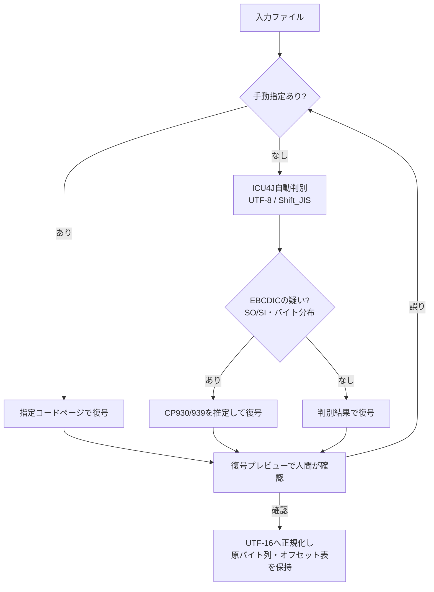
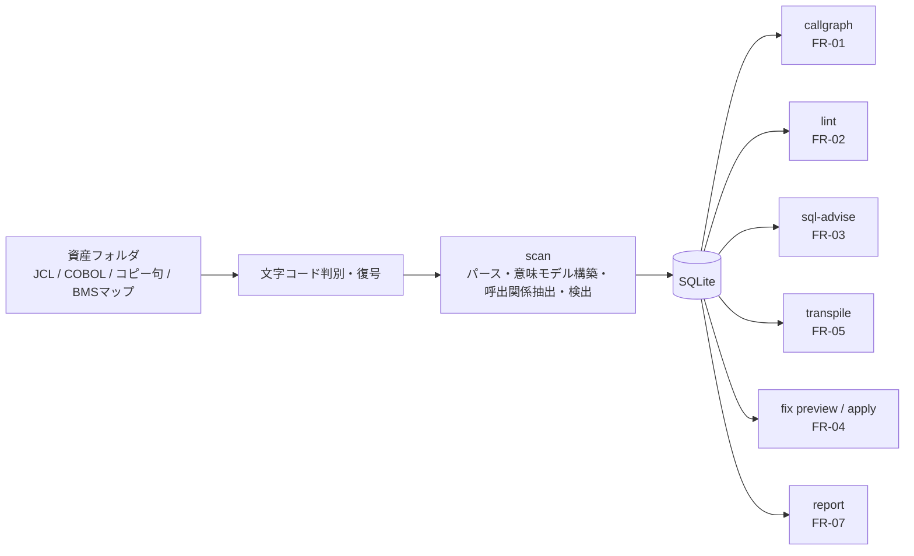
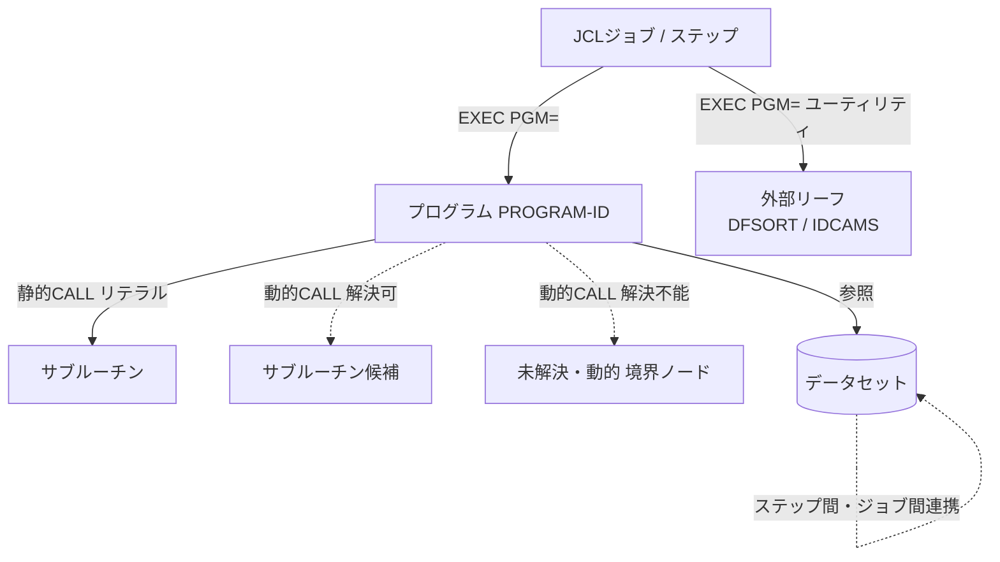

# 02 要件定義

## 1. 本書の位置づけ

本書は、COBOL静的解析支援を行う本アプリケーション（COBOL Insight）の要件を定義する。以降、本書では「本アプリケーション」と表記する。機能要件・非機能要件・前提・制約・受入基準を、実装判断が本書単独で成り立つだけの具体性をもって記す。

本アプリケーションは、IBM Enterprise COBOL・MVS JCL・埋め込みDb2 SQLで構成されるメインフレーム資産を対象に、次の5機能を提供する。

1. JCLからプログラムへ、プログラムからサブルーチンへの呼出関係の図示
2. バグ検出の静的解析
3. SQL最適化助言
4. 修正案生成とdiff表示
5. COBOL各行のPython/Java逐語対訳（最適化なし）

動作環境はWindows 11でローカル完結し、ネットワーク通信を一切行わない。GUIとCLIの両方を提供する。実現方式は決定論的ルールベースを既定とする。

### 1.1 文書一式の中での分担

本アプリケーションのドキュメントは5冊で構成される。本書は要件定義を担う。他の4冊が扱う内容は次のとおりであり、本書へは転記しない。

| ファイル | 扱う内容 |
|---|---|
| `01_企画コンセプト.md` | 背景・目的・提供価値と、アプリケーション名称の候補提案。 |
| `03_技術選定.md` | 言語・ライブラリ・実行系の選定と根拠（Java単一コア、Che4z・MAPA・JSqlParser・Electron）。 |
| `04_アーキテクチャ設計.md` | モジュール構成・レイヤー・インターフェース・データモデルの設計。 |
| `05_開発計画.md` | 工程・マイルストーン・体制・段階導入の計画。 |

技術選定の詳細は`03_技術選定.md`に従い、本書ではその決定を前提として要件を述べる。

## 2. 解析対象と入力

### 2.1 解析対象資産

解析対象は次の4種類の資産である。

- COBOL本体プログラム（IBM Enterprise COBOL、固定形式ソース）
- MVS JCL（JOB/EXEC/DD、カタログ化PROC・インストリームPROC、シンボリックパラメータ、COND、IF/THEN/ELSE/ENDIF、JCLLIB、INCLUDEを含む）
- コピー句（COPY/REPLACE展開の対象、REDEFINES・OCCURS・COMP-3・88レベルを含む）
- BMSマップ定義ファイル（DFHMSD/DFHMDI/DFHMDFマクロによるマップセット・マップ・フィールドの定義。3.11節）

埋め込みDb2 SQL（EXEC SQL〜END-EXEC）と埋め込みCICS（EXEC CICS〜END-EXEC）はCOBOL本体の一部として抽出・解析する。CICSはBMSマップとトランザクション遷移を含めて解析する（3.11節）。解析対象はIBM Enterprise COBOL・MVS JCL・Db2に限る。

### 2.2 解析入力フォルダと拡張子規約

解析入力は資産フォルダの指定で与える。フォルダ配下を再帰的に走査し、拡張子で資産種別を判定する。既定の拡張子規約は次のとおりとし、プロジェクト単位で追加・変更できる。

| 資産種別 | 既定の拡張子 |
|---|---|
| COBOL本体 | `.cbl`、`.cob` |
| コピー句 | `.cpy` |
| JCL | `.jcl` |
| BMSマップ | `.bms` |

コピー句はCOPY文の指定名と探索パスで名前解決する。探索パスは資産フォルダ配下のコピー句フォルダ群を既定とし、追加のパスを指定できる。同名コピー句が複数パスに存在する場合は、探索パスの順序で先に見つかったものを採用し、その解決結果を記録する。

トランザクション定義表は、CICSトランザクションIDとプログラム名の対応を示す任意入力のCSVファイル（1列目にトランザクションID、2列目にプログラム名）であり、CLIオプションまたはGUI設定でパスを指定する。詳細はFR-08（3.11節）に従う。

### 2.3 文字コード要件

取り込み時に、ファイル単位で文字コードを判別または指定し、復号する。処理の要件は次のとおりである。

- Shift_JISとUTF-8はICU4Jによる内容判別で自動判別する。
- EBCDIC（CP930/939）は、バイト分布とSO/SI（0x0E/0x0F）の検出により推定する。復号にはSO/SIシフトを解釈するIBM系Charset（CP930はx-IBM930、CP939はx-IBM939）を用い、PIC N/NCの全角・半角カナを含むDBCS混在を扱う。
- EBCDICの自動判別は初期推定にとどめ、ファイル単位・データセット単位のコードページ手動指定を、CLIフラグとGUI設定で常時提供する。手動指定は自動判別の結果に優先する。
- 復号直後にプレビューを提示し、判別結果を人間が確認できる工程を必ず設ける。プレビューで誤りを認めた場合、コードページを手動指定して再復号する。
- 内部表現はUTF-16へ正規化する。同時に原バイト列とオフセット表を保持し、修正の往復書き戻し（3.5節）で原コードページを破壊せずに書き戻せるようにする。

JEF（富士通）・KEIS（日立）はCharsetプロバイダの差し替えで対応する将来拡張点であり、初版の対象外である。

文字コード判別と復号の処理経路を次に示す。

### 2.4 増分解析

解析はソース単位の内容ハッシュを保持し、再解析時に変更されたメンバのみを再処理する増分解析を備える。要件は次のとおりである。

- 各ソース（COBOL本体・コピー句・JCL）の内容ハッシュを永続化する。
- 再実行時、ハッシュが一致するソースは再パースせず、既存の解析結果を再利用する。
- ハッシュが変化したソースと、その依存関係にあるソース（当該コピー句を取り込むプログラムと、当該プログラムを呼ぶJCLの2種に限る）のみを再解析する。
- ファイル単位の並列パースにより、変更単位とその依存だけを再処理する。

## 3. 機能要件

5機能に加え、5機能が共有する統合解析（scan）と統合レポート（report）を機能要件として定義する。全機能はGUIとCLIの双方で提供する。GUIは各CLIサブコマンドをサブプロセスとして起動し、結果をSQLite/JSON経由で受け取る。この構造により、GUIとCLIの機能パリティを保証する（3.10節）。

解析パイプラインの全体像を次に示す。

### 3.1 FR-01 呼出関係の図示（callgraphサブコマンド）

**概要**: JCL・プログラム・サブルーチン・データセットの呼出関係を単一のグラフモデルとして抽出し、図示する。

**入力**: 資産フォルダ（またはscan済みのSQLite）。JCLのEXEC PGM、COBOLのPROGRAM-ID、静的CALL（リテラル）、動的CALL（変数指定）、コピー句のCOPY、DD文とデータセット名を素材とする。

**処理**:

- JCLの`EXEC PGM=`とCOBOLのPROGRAM-IDを対応づける。
- 静的CALL（`CALL 'リテラル'`）はリテラルで直接解決する。
- 動的CALL（`CALL 変数`）は定数伝播・def-use・値集合解析で呼出先候補を解決する。解決不能なものは、変数名を付した「未解決（動的）」の境界ノードとして可視化する。
- DFSORT・IDCAMS・IEBGENER・PL/I・アセンブラの5種に限り、種別タグを付した外部リーフノードとして表す。
- コピー句は探索パスでファイルを横断して解決する。
- ステップ間・ジョブ間のデータセット連携（あるステップの出力を後続ステップ・後続ジョブが入力とする関係）をエッジとして表す。
- JCLのIF/THEN/ELSEとCONDは実行時リターンコードに依存し、静的解析では分岐が一意に定まらない。両分岐を「発生し得る経路」として提示し、条件分岐であることを明示する。
- 各エッジの解決根拠（定数由来・データフロー由来・未解決）を検出結果（findings）へ記録する。精度に関する数値的な主張は示さず、解決根拠の分類のみを提示する。

呼出関係グラフのノードとエッジの種別を次に示す。

**出力**:

- グラフモデルの正本: グラフJSONとDOT。ノード（JCL・プログラム・サブルーチン・未解決境界・外部リーフ・データセット）とエッジ（EXEC PGM・静的CALL・動的CALL・データセット連携）を表現する。
- 図: SVGおよびPNG。
- レポート埋め込みの図: Mermaid。

**CLI**: `callgraph`サブコマンドがグラフJSON/DOTを出力し、graphviz-javaでSVG/PNGを生成する。全体を一括描画する静的出力はCLI側で担う。

**GUI**: グラフモデルを正本として、Cytoscape.jsとELKによる層化レイアウトで対話的に描画する。フィルタ・部分展開・詳細度制御を備え、SVGへ書き出せる。グラフの全体一括描画はCLIの静的出力で提供する。

### 3.2 FR-02 バグ検出の静的解析（lintサブコマンド）

**概要**: COBOL資産に対しルールベースの静的解析を行い、バグとコードスメルを検出する。

**入力**: 資産フォルダ（またはscan済みのSQLite）。COBOL本体・コピー句・埋め込みSQLを対象とする。

**処理**:

- 初版のバグ検出ルールは31件、SQL助言ルール（FR-03）は6件とする。バグ検出ルールはServiceLoaderで発見するプラグインとして実装し、既存コードを改変せずにルールを追加できる。
- ルールは解析深度で3段階に分ける。構文のみで判定する第1段の7件、制御フローグラフ（CFG）またはBMSマップとの突合に依存する第2段の13件（R031〔存在しないBMSマップ・フィールドの参照。3.11節〕を含む）、手続き間データフローに依存する第3段の11件の計31件である。データフロー依存ルールは、到達定義・区間/値域・汚染追跡・生存変数を共有の単調不動点エンジンで解析する。
- コードスメル寄りのルール（R009 GO TOの使用・R025 同一式の重複の2件）は既定のseverityを警告とする。
- 全ルールは既定で有効とし、利用者はCLIオプションまたはGUI設定によりルール単位で無効化できる（4.5節）。
- 個々のルールのID・名称・カテゴリ・説明・既定severity・解析段階は`06_ルールカタログ.md`を正本とする。

**出力**:

- 検出結果: SARIF。各検出にルールID・severity・位置（ファイル・行）・メッセージを含む。
- レポート: HTMLおよびテキスト。

**CLI**: `lint`サブコマンドがSARIF/JSON/テキストを出力し、CI向けの終了コードを返す。

**GUI**: 検出結果の一覧と、ソース該当箇所への遷移を提供する。

### 3.3 FR-03 SQL最適化助言（sql-adviseサブコマンド）

**概要**: 埋め込みDb2 SQLを対象に、構文レベルの最適化助言を行う。

**入力**: 資産フォルダ（またはscan済みのSQLite）。COBOL本体から抽出した埋め込みSQLを対象とする。

**処理**:

- 埋め込みSQLの前処理を必須とする。EXEC SQL〜END-EXEC・DECLARE CURSOR・WHENEVER・BEGIN/END DECLARE SECTIONを分離し、ハイフンを含むCOBOLホスト変数を安全な識別子へ可逆にマングリングし、指示変数（`:host:ind`）を分解する。双方向マップで原データ名を復元する。
- SQL助言は6ルールとし、いずれも構文レベル（EXPLAIN非依存・カタログ非依存）に限定する。これによりローカル完結と決定論性を保つ。
- OPTIMIZE FORとWITH URの2句（パーサーが構文木に落とし込まないDb2固有句）は、抽出したSQLテキストへのトークン検査・正規表現検査で補う。
- 個々のルールのID・名称・カテゴリ・説明・既定severity・判定方法は`06_ルールカタログ.md`を正本とする。

**出力**:

- 助言結果: SARIF（FR-02と同一の検出結果形式）。
- レポート: HTMLおよびテキスト。

**CLI**: `sql-advise`サブコマンドがSARIF/JSON/テキストを出力する。

**GUI**: 助言結果の一覧と、該当SQL・該当ソース行への遷移を提供する。

### 3.4 FR-04 修正案生成とdiff表示（fixサブコマンド）

**概要**: 検出結果に対する修正案を生成し、差分を表示する。適用は明示操作に限り、原本ファイルは書き換えない。

**入力**: 検出結果（FR-02・FR-03）と対象ソース。

**処理**:

- 各ルールは任意で修正案の生成処理を提供し、構文木の位置に紐づく最小の編集（該当範囲の置換）を返す。修正箇所がコピー句の中にある場合も、同様に差分を提示する。
- 修正の適用はAST再印字を用いず、ANTLRのTokenStreamRewriterで原ソースのトークンストリームへ範囲単位で編集する。固定形式ノーマライザが、変更した物理行にのみ桁規則を強制する。桁規則は、B領域を8〜72桁とし、72桁を超える行は継続行（7桁目`-`）へ分割し、一連番号欄（1〜6桁）と識別欄（73〜80桁）を不可侵とする。桁計算はDBCS混在に備えバイト単位で行う。
- 自動修正の対象は、定型の修正手段を持つルールに限る。ON SIZE ERROR句の付与、FILE STATUS検査の挿入、SQLCODE検査の挿入、CICS応答コード（RESP/RESP2）検査の挿入がこれにあたる。未初期化変数の是正・汚染SQLの是正のように判断を要するルールは助言のみとし、自動修正しない。
- 「パース→無編集リライトでバイト一致」のゴールデンテストで往復忠実性を保証し、適用後に再パースして検証する。

**出力**:

- 差分: unified diff（java-diff-utilsが算出する単一正本）。修正箇所がコピー句の展開に由来する場合は、当該コピー句を取り込んでいる全プログラムの一覧を併せて出力する。
- 適用結果: 原本ファイルを書き換えず、元の相対パス構成を保った出力先ディレクトリへ書き出した修正後のソース（fix applyのみ）と適用ログ。

**CLI**: `fix`サブコマンドを`preview`と`apply`のサブ操作に分ける。`fix preview`はunified diffを表示し、任意でdiff2htmlによる静的HTMLレポートを出力する。ソースは書き換えない。`fix apply`は原本ファイルを書き換えず、修正後ソースを出力先ディレクトリへ書き出す。出力先は既定値（出力先ルート直下の`fix\`）を持つオプションで指定でき、元の相対パス構成を保って書き出す。

**GUI**: Monaco Editorのdiffビューで左右差分を表示する。適用はGUI上の明示操作に限り、書き出し先は原本と別のディレクトリとする。

### 3.5 FR-04の安全原則（修正適用）

修正適用は原本ファイルに対する破壊的操作になり得るため、次の安全原則を要件とする。

- **明示操作限定**: ソースからの書き出しは`fix apply`またはGUIの明示的な適用操作でのみ実行する。`scan`・`lint`・`sql-advise`・`fix preview`はソースを一切書き換えない。
- **原本不変更**: `fix apply`は原本ファイルを書き換えない。修正後のソースは、元の相対パス構成を保った別ディレクトリ（既定は出力先ルート直下の`fix\`）へ書き出す。出力先は既定値つきのオプションで指定できる。
- **コピー句に対する修正案の一覧提示**: 修正対象がコピー句の展開に由来する場合、当該コピー句を取り込んでいる全プログラムの一覧を修正案と併せて提示する。
- **往復忠実性の検証**: 適用後に再パースして構文の健全性を検証する。無編集リライトが原ソースとバイト一致することをゴールデンテストで保証する。
- **原コードページの保持**: 原バイト列とオフセット表（2.3節）を用い、Shift_JIS・EBCDIC資産をコードページ破壊なく書き出す。

### 3.6 FR-05 Python/Java逐語対訳（transpileサブコマンド）

**概要**: COBOL各行を、最適化を加えずPythonまたはJavaへ逐語対訳し、行単位で相互リンクする。

**入力**: 対象COBOL本体（またはscan済みのSQLite）。出力言語（Python/Java）を指定する。

**処理**:

- 構文解析結果から構築する正規化意味モデル（`04_アーキテクチャ設計.md`が定義）とIR（中間表現）の上に、決定論的で最適化を行わないルールベースの変換層を用いる。
- PERFORM・GO TO・REDEFINES・COMP-3・88レベル・ファイルI-Oを構文別のルールとして変換する。REDEFINESはバイト列とget/setアクセサ方式で表す。
- 直訳が困難な構文（GO TOとREDEFINESの2構文）は、注記を付し、COBOL1行が生成側複数行に対応する関係、または生成側1行がCOBOL複数行に対応する関係を可視化する。

**出力**:

- 生成ソース: PythonまたはJava。
- 行対応表: COBOL行と生成行の対応（1対N・N対1）を表す表と、GUIリンク用のアンカー。JSON形式を正本とし、HTMLでも提示する。

**CLI**: `transpile`サブコマンドが生成ソースと行対応表（JSON/HTML）を出力する。

**GUI**: COBOLソースと生成ソースを左右に並置し、行対応表のアンカーで行単位に相互リンクする。

### 3.7 FR-06 統合スキャンと永続化（scanサブコマンド）

**概要**: 資産フォルダ全体を解析し、結果をSQLiteへ永続化する。5機能はこの結果を共有する。

**入力**: 資産フォルダ、コピー句探索パス、文字コード指定（任意）。

**処理**: 文字コード判別・復号（2.3節）、パース、正規化意味モデル（`04_アーキテクチャ設計.md`が定義）の構築、呼出関係抽出、検出結果の生成を行う。増分解析（2.4節）により、変更メンバとその依存のみを再処理する。

**出力**: SQLiteデータベース。プログラム・段落・呼出エッジ・検出結果・SQL文・行対応・文字コード情報を格納する。処理サマリをJSONで出力する。

**CLI**: `scan`サブコマンド。

**GUI**: 資産フォルダの指定・文字コードのプレビュー確認・スキャン実行を提供する。

### 3.8 FR-07 統合レポート（reportサブコマンド）

**概要**: scan・lint・sql-advise・callgraphの結果を統合したレポートを生成する。

**入力**: scan済みのSQLite。

**出力**: HTMLおよびテキストのレポート。検出結果一覧・呼出関係の要約・SQL助言を含む。CI向けの終了コードを返す。

**CLI**: `report`サブコマンド。

**GUI**: レポートの表示とファイル書き出しを提供する。

### 3.9 CLIサブコマンドと機能の対応

| サブコマンド | 対応FR | 主な出力 |
|---|---|---|
| `scan` | FR-06 | SQLite、JSONサマリ |
| `callgraph` | FR-01・FR-08 | グラフJSON/DOT、SVG/PNG、Mermaid |
| `lint` | FR-02・FR-08 | SARIF、HTML/テキスト |
| `sql-advise` | FR-03 | SARIF、HTML/テキスト |
| `transpile` | FR-05 | 生成ソース（Python/Java）、行対応表（JSON/HTML） |
| `fix preview` | FR-04 | unified diff、HTMLレポート |
| `fix apply` | FR-04 | 出力先ディレクトリへの書き出し後ソース、適用ログ |
| `report` | FR-07 | HTML/テキスト統合レポート |

### 3.10 GUIとCLIの機能パリティ

GUIは各CLIサブコマンドをサブプロセスとして起動し、結果をSQLite/JSON経由で受け取る。GUIとCLIは同一の解析ロジックを共有し、解析ロジックを二重実装しない。GUI・CLIの間でループバックソケット等のネットワーク通信を用いず、動作環境の前提である「ネットワーク通信を行わないこと」を厳守する。

提供形態の前提により、GUI画面のReact/HTMLコンポーネントは後日Claude Designで作成して取り込む。本フェーズは画面コンポーネントの実装を対象とせず、GUIの提供形態（各機能をどの入力・出力・操作で提供するか）を要件として定義する。

### 3.11 FR-08 CICS解析（BMSマップ・トランザクション遷移）

**概要**: 埋め込みCICSコマンドとBMSマップ定義を解析し、トランザクション遷移と画面マップ参照を呼出関係グラフへ反映する。

**入力**: 資産フォルダ配下のBMSマップ定義ファイル（拡張子`.bms`）、COBOL本体中のEXEC CICSコマンド、および任意入力のトランザクション定義表（CSV形式。1列目にトランザクションID、2列目にプログラム名を持つ）。

**処理**:

- BMSマップ定義ファイル中のDFHMSD・DFHMDI・DFHMDFマクロを解析し、マップセット・マップ・フィールド（名称・位置・長さ・属性）を抽出する。
- 次のEXEC CICSコマンドを解析する: SEND MAP、RECEIVE MAP、XCTL、LINK、START、RETURN TRANSID。
- 呼出関係グラフ（3.1節のグラフモデル）へ、トランザクション遷移（XCTL・LINK・START・RETURN TRANSID）の辺と、画面マップ参照の辺を追加する。RETURN TRANSIDが指定する次トランザクションへの遷移は、疑似会話フローとして表現する。
- トランザクションIDからプログラムへの対応は、任意入力のトランザクション定義表とソース中の指定から解決する。解決できない場合は、未解決ノードとして呼出関係図に表す。
- BMSマップ定義に存在しないマップ・フィールドへの参照をR031として検出する。

**出力**:

- 呼出関係グラフへのトランザクション遷移エッジ・画面マップ参照エッジの追加（グラフJSON/DOT、3.1節）。
- 検出結果: R031「存在しないBMSマップ・フィールドの参照」。ID・名称・カテゴリ・説明・既定severity・解析段階は`06_ルールカタログ.md`を正本とする。

**CLI**: `callgraph`サブコマンドおよび`lint`サブコマンドが、BMSマップ定義ファイルとトランザクション定義表を追加入力として受け付ける。

**GUI**: 呼出関係図上でトランザクション遷移・画面マップ参照のエッジを表示する。

## 4. 非機能要件

### 4.1 性能

性能に関する数値目標は定めない。解析結果の正しさを優先する。

増分解析（2.4節）により、変更されたソースとその依存のみを再処理する。呼出関係図は、GUIではフィルタ・部分展開・詳細度制御によって分割表示し、全体を一括描画する静的出力はCLI側で提供する（3.1節）。

### 4.2 オフライン完結

- 本アプリケーションはネットワーク通信を一切行わない（動作環境の前提）。解析・描画・diff表示・レポート生成の全処理をローカルで完結する。
- 全依存を配布物へ内蔵する。Monaco Editorのvsソースをローカルにバンドルしてローカルパスから読み込み、描画に用いるライブラリ（Cytoscape.js・ELK・graphviz-javaを含む）はすべてローカルに同梱し、実行時に外部から取得しない。CDN・外部フォント・外部スクリプトへ接続しない。
- GUIとCLIの連携はサブプロセス起動とSQLite/JSONのファイル受け渡しで行い、ソケット通信を用いない。

### 4.3 配布

- CLIとコア解析エンジンは、jpackageで内蔵JREを同梱したWindows app-imageとして配布する。利用者側にJavaの別途インストールを要求しない。
- GUIシェルはelectron-builderでZIP形式のポータブル配布物を生成する。Chromiumを同梱し、WebView2等の常駐に依存しない。
- 導入はZIPを任意のフォルダへ展開するだけで完了し、インストーラの実行・管理者権限・レジストリへの書込を要さない。設定・キャッシュ・ログの保存先を展開先直下の`data`フォルダとし、利用者プロファイル配下へ書き込まない。展開先が読み取り専用の場合に限り、保存先をOSの既定位置へ委ねる。
- コード署名証明書は調達せず、生成した配布物は署名なしで提供する。SmartScreen警告に対する利用者向けの対処手順は導入手順書に記載する。実装着手前に実機Windows 11で配布物を試作し、SmartScreenの挙動・配布サイズ・起動時間を検証する。
- Electronと内蔵JREの二重ランタイムによる配布サイズと起動時間の増加は、内部ツールとして受容する。

### 4.4 ログ

- 解析実行・エラー・警告をローカルファイルへ記録する。ログをネットワークへ送信しない。
- ログには、対象資産・処理時間・検出件数・文字コード判別結果・失敗した処理を記録し、再現と原因調査に用いる。

### 4.5 検出ルールの既定有効化と個別無効化

- バグ検出ルール（3.2節）およびSQL助言ルール（3.3節）は、全件を既定で有効とする。
- 利用者は、CLIオプションまたはGUI設定によりルール単位で無効化できる。
- 各ルールの既定severityは`06_ルールカタログ.md`の値を正本とする。

### 4.6 決定論性

- 解析・検出・修正案生成・逐語対訳は決定論的ルールベースを既定とする。同一入力に対し同一出力を返す。
- ローカルLLMの併用は将来拡張であり、transpileとfixにAIアダプタの接続点（seam）のみを設ける。初版はLLMを用いず、完全に決定論的に動作する。

## 5. 前提・制約

- **動作環境**: Windows 11でローカル完結する。ネットワーク通信を行わない。
- **提供形態**: GUIとCLIの両方を提供する。GUI画面のReact/HTMLコンポーネントは後日Claude Designで作成して取り込み、本フェーズの対象外とする。
- **対象方言**: 解析対象はIBM Enterprise COBOL・MVS JCL・Db2に限る。
- **CICSの範囲**: 初版のCICS対応は、埋め込みCICSコマンドの解析とBMSマップ定義の解析を含む（3.11節）。RESP/RESP2の未検査（R021）とRETURN欠如（R022）の検出に加え、BMSマップ・フィールドの参照整合（R031）を検出し、呼出関係図へトランザクション遷移と画面マップ参照を反映する。
- **実現方式**: 決定論的ルールベースを既定とし、ローカルLLM併用は将来拡張である。
- **OSSの取り込み方針**: COBOLパーサー（Che4z COBOL Language Support）とJCLパーサー（MAPA）は、フォークせず上流リリースに追従するソースビルドとして取り込む。利用バージョンを固定し、上流更新は検証を経て取り込む。
- **文字コードの限界**: EBCDIC（CP930/939）の自動判別は本質的に不確実であり、ファイル単位・データセット単位の手動指定と復号プレビューでの人間確認を必須の工程として常に備える（2.3節）。
- **性能**: 数値目標は定めず、解析結果の正しさを優先する（4.1節）。

## 6. 受入基準

受入は、`samples/`配下の模擬資産と`samples/期待結果.md`（正解データ）を正とし、本アプリケーションの出力が期待結果と一致することを基準とする。行番号・欠陥種別・呼出関係の詳細は`samples/期待結果.md`を参照し、本書へ転記しない。

### 6.1 資産構成

`samples/`は、JCL 3本（`samples/jcl/`）、COBOL 9本（`samples/cobol/`）、コピー句 3本（`samples/copybook/`）、文字コード検証用2本（`samples/encoding/`）、BMSマップ定義1本（`samples/bms/`）、トランザクション定義表1本（`samples/cics/`）、および正解データ`samples/期待結果.md`を収録し、意図的に混入した欠陥15件とCICS関連の検出3件（6.6節）、呼出関係の正解を含む。

### 6.2 バグ検出の受入（FR-02・FR-03）

- `samples/期待結果.md`の「2. 混入した欠陥一覧」に記す9種別・計15件の欠陥を、対応するルールで検出することを基準とする。各欠陥の対象ファイル・行番号・種別は同書を参照する。
- 検出位置（ファイルと行）が同書の記載と一致することを確認する。
- 15件以外の検出（過検出）があれば、件数と内容を記録する。過検出の数値上の許容水準は定めない。

### 6.3 呼出関係抽出の受入（FR-01）

`samples/期待結果.md`の「4. JCL→プログラム→サブルーチン→データセットの呼出関係（正解）」「5. プログラム呼出関係（CALL）一覧」「6. コピー句の使用状況」を正解とし、次の一致を基準とする。

- JCLの`EXEC PGM=`とPROGRAM-IDの対応。
- 静的CALLと動的CALLの呼出先解決。動的CALLは変数へ設定した値からの解決を含む。
- カタログ化PROC・インストリームPROCの展開とシンボリックパラメータの解決。
- ステップ間・ジョブ間のデータセット連携。
- コピー句の使用箇所とREPLACING。

### 6.4 文字コードの受入

`samples/期待結果.md`の「7. 文字コード検証結果」を正とし、次を基準とする。

- `samples/encoding/`のUTF-8版とShift_JIS版を、それぞれ自動判別で正しく判別・復号し、同一の解析結果を得ること。
- EBCDIC版の資産は`samples/`に収録しない。受入テストの実行時に、`samples/encoding/SYKENC1_UTF8.cbl`をJDK同梱のx-IBM930 Charsetで変換したEBCDICテストデータを一時生成し、CP930の手動指定でそれを復号した結果が元の`SYKENC1_UTF8.cbl`の内容とバイト単位で一致すること、および復号プレビューに内容が表示されることを完了条件とする。

### 6.5 修正適用の受入（FR-04）

- 自動修正の対象ルール（ON SIZE ERROR付与・FILE STATUS検査挿入・SQLCODE検査挿入・RESP/RESP2検査挿入）について、「パース→無編集リライトでバイト一致」のゴールデンテストが通ること。
- 修正適用後に再パースして構文が健全であること。
- `fix apply`が原本ファイルを書き換えず、元の相対パス構成を保った出力先ディレクトリへ修正後のソースを書き出すこと。
- コピー句に対する修正案が、当該コピー句を取り込んでいる全プログラムの一覧とともに提示されること。

### 6.6 CICSの受入基準

模擬資産`samples/bms/SYKMAP1.bms`、`samples/cobol/SYK008.cbl`（疑似会話プログラム）、`samples/cobol/SYK009.cbl`、`samples/cics/トランザクション定義表.csv`を対象に、次を基準とする。

- R021が`SYK008.cbl`で1件、R022が`SYK009.cbl`で1件、R031が`SYK008.cbl`で1件検出されること。
- 呼出関係図に、`SYK008.cbl`から`SYK009.cbl`へのXCTL遷移が現れること。
- 呼出関係図に、`RETURN TRANSID('SYK8')`をトランザクション定義表で解決して得られる`SYK008.cbl`への疑似会話遷移が現れること。
