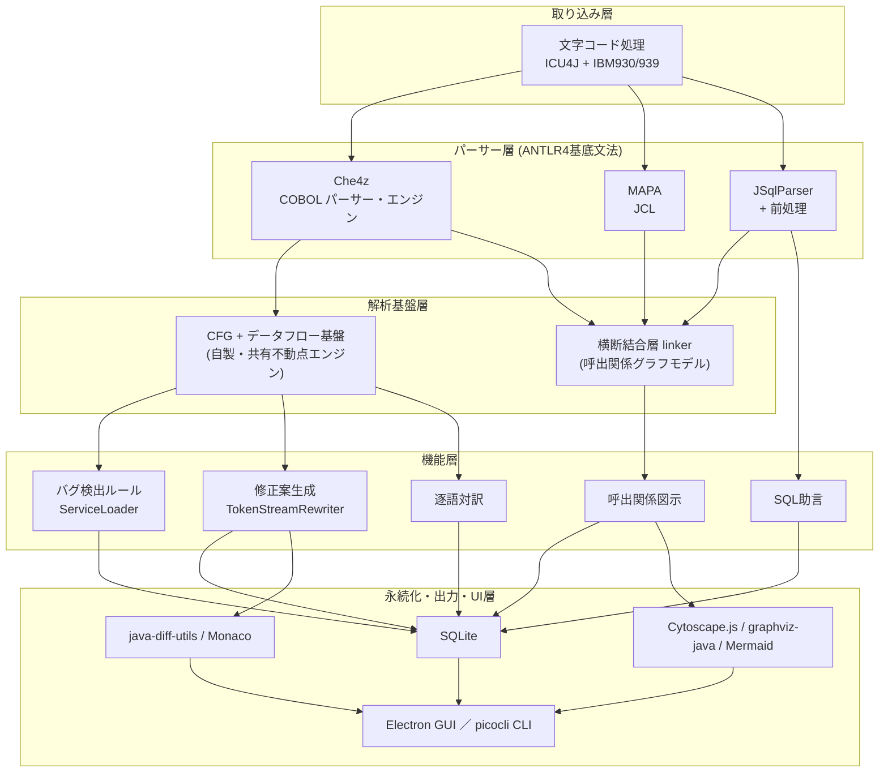
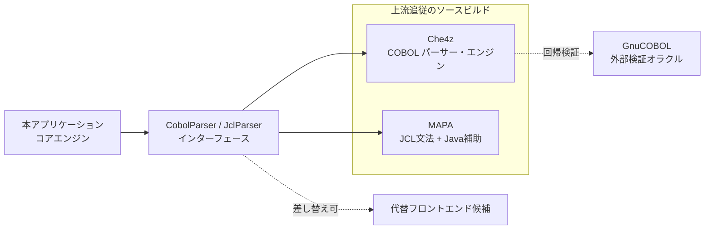

# 03 技術選定

本書は、本アプリケーション(COBOL Insight。COBOL静的解析支援ツール)の技術スタックを確定する。COBOL意味解析・JCL解析・埋め込みSQL解析・呼出関係可視化・バグ検出・SQL助言・修正案生成・逐語対訳の各機能を、どの言語・ライブラリ・実現方式で構成するかを決め、採用理由と退けた代替案を構成要素ごとに記録する。

本アプリケーションの企画意図と提供価値は `01_企画コンセプト.md` が、5機能の機能要件・非機能要件と31件のバグ検出ルール・6件のSQL助言ルールの仕様は `02_要件定義.md` が、本書で確定したスタックに基づくモジュール分割・データモデル・処理フローは `04_アーキテクチャ設計.md` が、工数見積りと段階導入計画は `05_開発計画.md` がそれぞれ扱う。本書はそれらの内容を転記せず、技術選定の正本としての役割に絞る。

---

## 1. 選定方針

### 1.1 前提条件

技術選定は、以下の前提条件のもとで行う。

- **解析対象**: IBM Enterprise COBOL、MVS JCL、埋め込みDb2 SQLを対象とする。富士通/日立方言・Oracle対応は対象外とする。
- **文字コード**: Shift_JIS/UTF-8の自動判別と、EBCDIC(CP930/939)の推定および手動指定に対応する。
- **動作環境**: Windows 11でローカル完結し、ネットワーク通信を行わない。
- **提供形態**: GUIとCLIの両方を提供する。GUI画面のReact/HTML系デザインは後日取り込み、画面コンポーネント実装は本フェーズ対象外とする。
- **5機能**: (1)JCL→プログラム→サブルーチンの呼出関係図示、(2)バグ検出の静的解析、(3)SQL最適化助言、(4)修正案生成とdiff表示、(5)COBOL各行のPython/Java逐語対訳(最適化なし)。
- **実現方式**: ルールベースで完全に決定論的に動作させる。ローカルLLMはv1では使わず、逐語対訳・修正案生成にAIアダプタ接続点(seam)のみを設ける。
- **検証資産**: リポジトリ `samples/` 配下の模擬資産(JCL3本・COBOL7本・コピー句3本・文字コード検証用2本とその期待結果、および意図的欠陥15件・呼出関係の正解)で検証する。

### 1.2 評価基準

3つの構成案を、次の軸で評価した。

| 軸 | 内容 |
| --- | --- |
| 実装確実性 | 保守が継続する意味解析資産を再利用でき、再実装リスクを負わないか |
| 保守性・拡張性 | ルール・パーサー・文字コードの拡張を、基底に手を入れず差分で足せるか |
| 工数 | 5機能を満たすまでの見積り規模 |
| 要件充足 | ローカル完結・無通信・GUI/CLI両提供・決定論性を満たすか |

### 1.3 評価結果と採用構成

3案の評価点は次のとおりである。

| 構成案 | 評価点 | 要旨 |
| --- | --- | --- |
| 提案3: Java単一言語コア + プラグインルールエンジン | 41 | 総合評価点41は3案中最高である。インターフェース抽象とServiceLoaderルールプラグインで、ルール追加を基底に触れず行える。修正往復適用を無編集リライトのバイト一致検証で確認できる。 |
| 提案1: JVMコア単一エンジン + Electron Webビューシェル | 40 | Che4zのパーサー・エンジン層を再利用して実装確実性を確保する。総合評価点40は3案中2位に位置する。GUIにElectronを採り、デスクトップ配布の実績がある(VS Code・Slackが採用)。工数見積りは3案中最小にとどまる。 |
| 提案2: JVM単一基盤・自製IR/データフロー基盤 + WebView2シェル | 33 | 意味解析層を全面自製する。保守が継続するChe4zのパーサー・エンジン層も再利用せず意味解析層の再実装コストを正面から負うため、工数が3案中最長で、総合評価点33は3案中最低である。 |

採用構成は、総合評価点が3案中最高の**提案3を土台**とする。これに、GUIシェルとしてデスクトップ配布の実績(VS Code・Slackが採用)を持つ**提案1のElectron**を採る。さらに、固定形式ソースへの修正往復で書式破壊を避ける安全策(原本を書き換えず修正後ソースを出力ディレクトリへ書き出す方式、DBCS〔Double Byte Character Set、2バイト文字集合〕対応のバイト単位桁計算)を統合する。意味解析層を全面自製する提案2は、保守が継続するChe4zのパーサー・エンジン層を再利用する価値を捨て、実装確実性を損なうため退ける。

### 1.4 コア言語

コア解析エンジン・CLI・GUIホスト連携を**Java(JDK 21 LTS)**で統一し、GUIシェルとフロントエンドのみTypeScript(Electron + React)を用いる。合計2言語構成とする。主要な解析資産であるChe4z COBOL Language Support(COBOL)・MAPA(JCL)・JSqlParser(SQL)、およびCFG(Control Flow Graph、制御フローグラフ)/IR(Intermediate Representation、中間表現)の設計参照であるcobol-rektがすべてJVM上にあり、同一プロセスで言語境界なしに統合できることが決め手である。

---

## 2. 選定結果一覧

| # | 構成要素 | 採用技術 | 理由の要点 |
| --- | --- | --- | --- |
| 1 | コア解析エンジン・CLI実装言語 | Java (JDK 21 LTS)、Gradleマルチモジュール | 主要解析資産が全てJVM上にあり言語境界なしで統合。ANTLR4のJavaターゲットは生成パーサーがJVM内で完結し、追加のランタイムを要しない。 |
| 2 | COBOLパーサー・意味解析基盤 | Eclipse Che4z COBOL Language Support(EPL-2.0)をソースビルドで組込 | IBM Enterprise COBOL対応を明言。固定形式・COPY REPLACING・EXEC CICS・EXEC SQL対応。保守継続(v2.5.1、2026-06-30)。 |
| 3 | JCLパーサー | MAPA(MIT)を上流追従のソースビルドで利用 | PROC展開・シンボリックパラメータ・COND・IF-THEN-ELSEに対応するOSS(テスト用JCLを190件以上収録)。Java補助コードを流用可。 |
| 4 | SQLパーサー・埋め込みSQL前処理 | JSqlParser(Apache-2.0) + 2段前処理 | Db2/Oracle方言を公式対応しJVM同居。ハイフン入りホスト変数の可逆マングリングを必須設計とする。 |
| 5 | データフロー・制御フロー解析基盤 | Che4zパーサーと自前の正規化意味モデル上に自製、cobol-rekt(MIT)を設計参照 | 約1/3のルールが手続き間データフローを要す。共有単調不動点エンジンで重複を排除。 |
| 6 | 横断結合層(linker、機能1中核) | 自製モジュール(呼出関係グラフJSON/DOT生成) | 既存研究に資産なし。動的CALLは値集合解析で候補解決、未解決は型付き境界ノード化。 |
| 7 | バグ検出ルールエンジン | 31ルール+SQL助言6ルール、ServiceLoaderプラグイン、SARIF出力 | 「ルール追加=クラス1個」で保守性最優先要件に直接応える。解析深度3段階で段階導入。 |
| 8 | 拡張戦略 | ServiceLoaderルールプラグイン、インターフェース抽象 | ルール・パーサー・Charsetを差し替え可能にし、ルール追加を基底に触れず行う。 |
| 9 | GUIシェル | Electron(TypeScript + React、Chromium同梱)、electron-builderのZIPターゲット | WebView2常駐が無条件保証でないためChromium同梱でオフライン確実性を確保。展開して実行するポータブル配布で管理者権限を要さない。無通信でCLIをサブプロセス起動。 |
| 10 | 図描画 | Cytoscape.js + cytoscape-elk(GUI)、graphviz-java(CLI)、Mermaid(小規模) | グラフモデルを単一正本に共有。CLIラスタ出力はJVM内完結のgraphviz-javaで完結。 |
| 11 | diff表示 | java-diff-utils(算出) + Monaco Editor diff(GUI) + diff2html(CLI任意) | 差分計算をエンジンに一元化しGUI/CLIで一貫。Monacoはローカルバンドル必須。 |
| 12 | Python/Java逐語対訳 | Che4zパーサーと自前の正規化意味モデル上に自製の決定論変換層 | 「各行を最適化せず逐語対訳し行単位でリンク」を満たす既存ツールが存在しない。 |
| 13 | 修正案生成・固定形式往復適用 | FixProducer + ANTLR TokenStreamRewriter + 固定形式ノーマライザ | AST再印字を禁止し最小編集で書式破壊を回避。原本は書き換えず出力ディレクトリ(既定`fix\`)へ書き出す。バイト単位桁計算とゴールデンテストで保証。 |
| 14 | 文字コード処理 | ICU4J CharsetDetector + JRE同梱IBM930/939 | 自動判別に対応。EBCDICはSO/SI検出で推定し手動指定を常時併設。 |
| 15 | 解析結果の永続化 | 埋め込みSQLite(xerial sqlite-jdbc、Apache-2.0) | ローカル完結・サーバー不要・ファイル1個。隣接表+再帰CTEで呼出関係グラフを扱う。 |
| 16 | CLI構成 | picocli(Apache-2.0)、jpackageで内蔵JRE同梱 | GUIと同一のAPIファサードを共有し二重実装を排除。SARIF/JSON/HTML出力とCI終了コード。 |
| 17 | CICS対応・IBM COBOL妥当性検証 | BMSマップ自製ANTLR4文法 + EXEC CICS解析器 + GnuCOBOL(cobc -std=ibm)外部プロセス | v1でCICSを本格解析(BMSマップ・疑似会話フロー・R031)。GnuCOBOLをGPL波及なしの外部検証オラクルに用いる。 |

### 全体構成の層構造

---

## 3. 構成要素別の詳細

### 3.1 コア解析エンジンおよびCLIの実装言語

**採用**: Java (JDK 21 LTS)、Gradleマルチモジュール構成。

**理由**: COBOL意味解析(Che4zのパーサー・エンジン層)、JCL(MAPAのJava補助コード)、SQL(JSqlParser)、CFG/IR設計参照(cobol-rekt)という主要解析資産がすべてJVM上にあり、同一プロセスで言語境界なしに統合できる。Che4zのパーサー・エンジン層はJavaとANTLR4で実装され、意味解析のパッケージ(symbols/analysis等)を持つ。非Javaを選ぶと、この保守が継続するパーサー・エンジン層を再利用できず、COBOL意味解析基盤を一から再実装することになる。ANTLR4のJavaターゲットは生成パーサーがJVM内で完結し、数千本規模の解析を追加ランタイムなしで実行できる。

**退けた代替案**:
- **C#(.NET)**: grammars-v4のCobol85をC#へ再生成しても得られるのは構文解析器の骨格のみで、Che4zが持つ意味解析層は引き継がれない。
- **Python(sqlglot軸)**: ANTLR Python3ターゲットは大規模ソースで解析速度が顕著に遅い。
- **Rust(Tauri親和)**: ANTLR公式ターゲットにRustが無く、COBOL文法資産を再利用できない。

### 3.2 COBOLパーサーと意味解析基盤

**採用**: Eclipse Che4z COBOL Language Support(eclipse-che4z/che-che4z-lsp-for-cobol、Broadcomスポンサー、EPL-2.0、Java + ANTLR4)を採用する。`server` 配下のMavenマルチモジュール(common/engine/parser/dialect-daco/dialect-idms)をソースからビルドして組み込み、engineモジュールを意味解析基盤として利用する。`CobolParser` インターフェースの背後に置き、代替フロントエンドへ差し替え可能にする。

**理由**: IBM Enterprise COBOL対応を明言し、固定形式・COPY REPLACING・EXEC CICS・EXEC SQL(Db2)に対応する。保守が継続しており(直近52週で138コミット、最新コミット2026-07-09、最新リリースv2.5.1(2026-06-30))、上流のバグ修正・機能追加を取り込める。engineモジュールの意味解析パッケージが、機能(1)(2)(5)の素材になる。EPL-2.0は弱いコピーレフトであり、改変したモジュールのソース公開を条件に独自アプリケーションへの組み込みと配布を許すため、単一Windows配布物へ結合できる。Maven Centralに公開アーティファクトが無いため、ソースからMavenモジュールをビルドして組み込み、バージョンを固定する。意味情報APIの粒度は開発初期(M1)に実地検証し、不足する意味情報は構文木から自前の正規化意味モデルを構築して補う。この構成(Che4zのパーサー・エンジン層 + 自前の意味モデル・CFG・データフロー)を確定とする。

**退けた代替案**:
- **ProLeap COBOL Parser(uwol/proleap-cobol-parser、MIT)**: AST + ASG(Abstract Syntax Graph、構文解析結果を表すグラフ構造)のAPI適合度は高いが、実質的なソース変更が2024-01-25で止まり、最新リリースはv2.4.0(2018-01-01)、メンテナの最終Issue応答が2020年で、保守停止状態のため退ける。
- **Koopa(BSD、Java)**: 保守は継続する(最新リリース2026-05-16)が、構文木(CST)のみで意味情報を持たず、EXEC SQL/CICSは認識するだけで内部を解析しないため退ける。
- **SuperBOL Studio(MIT、OCaml)**: 活動は活発だが、IBM Enterprise COBOL特化でなく、構文木・意味情報を外部へ出力する手段が無く、Java 21からの利用経路が限られるため退ける。

### 3.3 JCLパーサー

**採用**: MAPA(cschneid-the-elder/mapa、MIT、Java + ANTLR4)を上流リリースに追従するソースビルドとして利用し、PROC展開・シンボリック解決のJava補助コード(PPProc・PPSymbolicの2クラス)を再利用する。`JclParser` インターフェースの背後に置く。

**理由**: JOB/EXEC/DD、カタログ化PROC展開、シンボリックパラメータ解決、ステップ/ジョブ両単位のCOND、IF/THEN/ELSE/ENDIF、JCLLIB、INCLUDEに対応するOSSであり、テスト用JCLを190件以上収録する。コア言語がJavaのため、他言語採用時に再実装が必要になるPROC/シンボリック解決ロジックをそのまま流用できる。MAPAのCSV/TSV出力とDemo01(作者が趣味・未完成と明記)は流用せず、呼出関係グラフモデルは自製する。単独メンテナによる開発(全コミットの99.9%が本人)だが活動は継続しており(直近12ヶ月で13コミット、最終更新2026-06-29)、上流リリースに追従するソースビルドとして利用する。単独メンテナのリスクと対応(バージョン固定・必要時のローカルパッチ)は `05_開発計画.md` のリスク管理で扱う。

**退けた代替案**: 代替候補11件はいずれも活動停止・エンジン非公開・未成熟で退ける。代表例を挙げる。
- **grossvater/jcl-parser**: 2019年開発停止、PROC/シンボリック解決を欠く。
- **MikeFultonDev/JCLParser**: C実装で呼出関係抽出が未実装。
- **Zowe/Broadcom/IBM系**: 構文ハイライト中心、または解析エンジンが非公開/非OSS。

### 3.4 SQLパーサーと埋め込みSQL前処理

**採用**: JSqlParser(Apache-2.0側を選択)。前段に必須の2段前処理を置く。第1段でEXEC SQL/END-EXEC・DECLARE CURSOR・WHENEVER・BEGIN/END DECLARE SECTIONを分離し、第2段でハイフン入りホスト変数を安全な識別子へ可逆マングリングし、指示変数 `:host:ind` を分解する。双方向マップで原データ名を復元する。

**理由**: Db2/Oracle方言を公式対応し、JVMに同居できる(ランタイム依存ゼロ)。重大な落とし穴として、JSqlParserは `:WS-CUSTOMER-ID` のようなハイフン入りCOBOLデータ名を減算式として無言で誤解析するため、ハイフンから安全な識別子への可逆マングリングと復元を必須設計とする。OPTIMIZE FOR・WITH URの2句(パーサーが構文木に落とさないDb2固有句)は、抽出SQLテキストへのトークン/正規表現検査で補う。SQL助言6ルールは構文レベル(EXPLAIN・カタログ非依存)に限定し、決定論性と局所完結を保つ。

**退けた代替案**:
- **sqlglot + IBM Db2プラグイン**: Python軸でJava中核と言語境界が生じ、プラグインは公開直後・個人2名主導でOPTIMIZE FOR/WITH UR/ホスト変数対応が未明記。
- **sqlfluff**: 方言追加がプラグイン対象外。
- **Apache Calcite**: スキーマ/カタログ前提で構文助言には過剰。
- **Gudusoft GSP**: 商用・価格非公開。

### 3.5 データフロー・制御フロー解析基盤

**採用**: Che4zのパーサー・エンジン層と自前の正規化意味モデルの上に自製する。CFG構築、GO TO正規化(Hendrenアルゴリズム: 不可約な分岐に到達するノードを複製し、単一入口の構造化制御フローへ変換する手法)、最小限の共有単調データフロー基盤(到達定義・区間/値域・汚染追跡・生存)を独立モジュール化する。cobol-rekt(MIT)のCFG/IRとgoto除去コードを設計参照とする。

**理由**: バグ31ルールの約1/3(R001未初期化、R005添字範囲、R012無限ループ、R015 REDEFINES、R016あふれ、R020汚染SQL、R027機密出力、R028符号なし負値ほか)が手続き間データフローを要する。Che4zのパーサー・エンジン層と正規化意味モデルはオブジェクトモデルにとどまり、これらを提供しない。到達定義・区間・汚染・生存はいずれも単調データフローであり、共通の不動点エンジンを1つ持てば重複実装を避けられる。ただし汎用フレームワークは作り込まず、31ルールが要求する解析のみに絞って過剰設計を避ける。この基盤は逐語対訳・修正案生成でも共用する。

**退けた代替案**:
- **既存OSSでそのまま賄う**: Che4z/cobol-rektに手続き間データフローの即戦力実装が無い。
- **ルール別に個別パスを完全独立実装(提案1の純粋形)**: 同型解析の不動点エンジンを共有する方が保守的である。
- **汎用拡張フレームワークの先行構築(提案2の一般化)**: 確定要件を超える過剰設計となる。

### 3.6 横断結合層(linker、機能1中核)

**採用**: JCLのEXEC PGM=とCOBOLのPROGRAM-IDの対応付け、静的CALLリテラルの解決、動的CALL(変数指定)の定数伝播/def-use/値集合解析による候補解決、解決不能なものの変数名付き「未解決(動的)」境界ノード化、DFSORT・IDCAMS・IEBGENER・PL/I・アセンブラの5種別に限る種別タグ付き外部リーフノード化、コピーブックの探索パスによるファイル横断解決を行う。単一の呼出関係グラフモデル(JSON/DOT)を生成する自製モジュールとする。

**理由**: 機能(1)の中核処理であり、既存研究に該当資産がないため自設計する。解決不能なCALL先とユーティリティを「空白点」として型付きノードで可視化し、グラフの完全性と正直さ(精度の過大主張回避)を両立する。解決根拠(定数由来/データフロー由来/未解決)を findings(3.7節で定義)に記録する。

**退けた代替案**:
- **IBM ADDI等の商用可視化**: 非公開・商用でローカル完結に反する。
- **動的CALLを一律未解決とする単純化**: 定数伝播で解決可能な範囲を取りこぼす。

### 3.7 バグ検出ルールエンジンとルールカタログ

**採用**: 初版は31ルール(R001〜R031) + SQL助言6ルールを採用する。R031は存在しないBMSマップ・フィールドの参照を検出するルールである。ServiceLoaderで発見するプラグイン(「ルール追加=クラス1個」)として実装する。解析深度で3段階(構文のみ7件 → CFG依存13件 → データフロー依存11件)に分けて段階導入する。findings(ルールの検出結果と呼出関係の解決結果を格納するレコード集合。呼出エッジは解決根拠〔定数由来/データフロー由来/未解決〕をフィールドに持つ)はSARIFで出力する。コードスメル寄りのルール(R009 GO TO、R025同一式の2件)は既定severityを警告とする。全ルールを既定で有効とし、利用者はルール単位で無効化できる。

**理由**: プラグイン化は保守性・拡張性の最優先要件に直接応え、ルール追加を基底に触れず行える。段階導入は第1段(構文のみ)で早期に価値提供し、データフロー依存ルールを後段へ回して工数リスクを制御する。

**退けた代替案**:
- **SonarSource/Fortify等の商用ルール直接利用**: 非公開・商用である。
- **ルールをハードコードする**: 拡張時に基底改変が必要で保守性が低い。

### 3.8 拡張戦略

**採用**: パーサー・解析器・ルール・Charsetをそれぞれ専用インターフェースの背後に置き、ルールはServiceLoaderで発見するプラグイン(「ルール追加=クラス1個」)として追加する。

**理由**: 対象はIBM Enterprise COBOL・MVS JCL・Db2に限るため、方言オーバーレイのような多方言拡張機構は設けない。一方、ルール追加とパーサー差し替えは確実に見込まれるため、この2点に絞ってインターフェース境界を設け、基底を触らず差分で足せるようにする。

**退けた代替案**:
- **各機能を基底へ直接ハードコードし差し替え点を持たない**: ルール追加や上流パーサー更新のたびに基底改変が必要で保守性が下がる。
- **投機的に多方言・多形式の拡張フレームワークを先行構築する**: 対象外の方言に備えた一般化は過剰設計となる。

### 3.9 GUIシェル

**採用**: Electron(TypeScript + React、Chromium同梱)を主軸とし、後日取り込むReact/HTML画面をホストする。JavaエンジンをCLIサブコマンドのサブプロセスとして起動し、結果をSQLite/JSON経由で受ける(ループバックソケットを使わず、無通信の前提を厳守する)。electron-builderのZIPターゲットで、展開して実行するポータブル配布物として配る。

**理由**: WebView2のWindows 11常駐は無条件保証でなく、N/LTSCエディションや企業イメージで除去され得るため、Chromium同梱でオフライン確実性を取る。Electronはデスクトップアプリの配布実績(VS Code・Slackが採用)を持ち、electron-builderによるパッケージングの手段が確立している。画面フロントエンドはReact/HTMLであり、シェルをTypeScriptにしても言語数はJava + TypeScriptの2に収まる。GUIが同一CLIサブコマンドを呼ぶことで、GUI/CLIの機能パリティを構造的に保証する。

**退けた代替案**:
- **.NET(WPF + WebView2)**: C#が第3言語となりChe4zのパーサー・エンジン層を再利用できず、WebView2非保証とPublishSingleFile既知バグを負う。
- **JVM内Chromium埋め込み(JCEF、Java Chromium Embedded Framework)**: 単一言語・単一ランタイムにできる次点だが、JCEF + jpackageのネイティブ同梱が未検証で本フェーズの確実性を下げる。二重ランタイムが問題化した場合の切替先として保持する。
- **WebView2のJVM内埋め込み**: バインディング成熟度が未検証で不安定化リスクがある。
- **Tauri**: RustがANTLR非対応で、sidecar二言語構成となる。

### 3.10 図描画(呼出関係図・ジョブフロー図)

**採用**: グラフモデル(JSON/DOT)を単一の正本とする。GUIはCytoscape.js(MIT) + cytoscape-elk経由のELK.js層化レイアウトで対話描画し、cytoscape-svgでSVGを書き出す。CLI/バッチの静的描画は、エンジンがDOTを出力しgraphviz-java(nidi3、Apache-2.0、JVM内)でSVG/PNGを生成する。小規模図・レポート埋め込みはMermaidを用いる。

**理由**: GUIとCLIが同一グラフモデルを共有し、二重実装を避ける。`@hpcc-js/wasm-graphviz` はSVGのみでPDF/PNG非対応のため、CLIのラスタ出力は別ランタイムを増やさずJVM内で完結するgraphviz-javaを採る。Cytoscape.jsは現行Canvasで約3200ノードが実用上限に近づくため、フィルタ・部分展開・詳細度制御を前提設計とし、全体一括描画はCLI静的出力へ寄せる。cytoscape-svg等の周辺拡張は保守にばらつきがある(2年以上更新なし)ため、バージョンを固定し、必要時にローカルパッチで対応する。

**退けた代替案**:
- **`@hpcc-js/wasm-graphviz` をCLIラスタ出力に使う**: PDF/PNG非対応である。
- **React Flow**: DOMベースで数千ノード描画に性能制約がある。
- **ネイティブGraphviz外部バイナリ**: 配布物に別ネイティブ依存を増やす(graphviz-javaが不調な場合のみ切替)。

### 3.11 diff表示

**採用**: 差分計算はエンジン内でjava-diff-utils(Apache-2.0)がunified diffを算出する(単一正本)。GUIはMonaco Editor diff(MIT、npmローカルバンドル、vsパスをローカル指定、COBOL用Monarch文法を追加)を用いる。CLIはANSI unified diffと、任意でdiff2htmlの静的HTMLレポートを用いる。

**理由**: 修正案生成が変更後ソースを生成するため、差分計算をエンジンに一元化してGUI/CLIで結果を一貫させる。Monacoは既定でvsソースをCDNから読むため、npmローカルバンドルとvsパスのローカル指定を必須手順とする(無通信の前提を守る)。

**退けた代替案**:
- **jsdiff(JS側)で計算する**: 修正生成元のエンジン(Java)から差分計算を切り離すと、往復整合の検証が分散する。
- **GUIをdiff2htmlのみにする**: IDE水準の左右差分・編集レビューをMonacoが担う。

### 3.12 Python/Java逐語対訳

**採用**: Che4zのパーサー・エンジン層と自前の正規化意味モデルの上に、自製の決定論的・最適化なしルールベース変換層を置く。PERFORM/GO TO/REDEFINES/COMP-3/88レベル/ファイルI-Oを構文別ルールとして実装する。COBOL行と生成行の対応表(1:N・N:1)とGUIリンク用アンカーを生成する。GO TO構造化はHendrenアルゴリズム(不可約分岐の複製による構造化)を適用し、複製後のブロック単位でPython/Java行を生成する。cobol-rektのCFG/IRは実装時の設計参照として付記する。REDEFINESはバイト列 + get/setアクセサ方式を用い、マッピングはopensourcecobol4jを参照する(リンクせず参照のみ)。

**理由**: 「各行を最適化せず逐語対訳し行単位で相互リンクする」を満たす既存ツールは存在しない(COB2PYは公開停止)。最適化なしの決定論変換は前提条件に合致する。直訳不能な構文(GO TO・REDEFINESの2構文)は注記付き・N:1可視化で提示する。

**退けた代替案**:
- **opensourcecobol4jのコード流用**: GPLv3でリンクすると波及し、かつ実行目的の変換で教育目的の可読性とは設計思想が異なる。
- **IBM watsonx / AWS Transform**: クラウド前提・非公開でローカル完結に反し、生成AIで決定論要件と不整合である。

### 3.13 修正案生成と固定形式ソースへの往復適用

**採用**: 各ルールが任意でFixProducerを提供し、AST位置に紐づく最小編集(該当範囲の置換)を返す。適用はAST再印字ではなく、ANTLRのTokenStreamRewriterで原ソースのトークンストリームへ範囲単位で編集する。固定形式ノーマライザが、変更した物理行のみ桁規則(数値仕様は`04_アーキテクチャ設計.md` §5に従う)を強制する。修正箇所がコピーブックの中にある修正案も差分として提示し、取り込んでいる全プログラムへの影響を併せて示す。原本ファイルは書き換えず、修正後ソースを元の相対パス構成を保った出力ディレクトリ(既定`fix\`)へ書き出す。「パース → 無編集リライトでバイト一致」のゴールデンテストで往復忠実性を保証し、バイト一致検証と適用後の再パース検証は出力ファイルに対して行う。

**理由**: 調査で完全に欠落していた領域のため自設計する。TokenStreamRewriterと隠しチャネルでのコメント保持により、未変更トークンは完全に温存されて最小diffになり、AST再印字が招く書式破壊を根本から避ける。全トークンに原ソース座標を保持しCOPY展開を貫いて元のソース位置へ逆変換して復元することで、Shift_JIS/EBCDIC資産をコードページ破壊なく往復させる。R004(ON SIZE ERROR付与)・R017(FILE STATUS検査挿入)・R018(SQLCODE検査挿入)・R021(RESP/RESP2検査挿入)の、定型的な修正を持つ4ルールのみ修正案を自動生成し、R001・R020のような判断を要するものは助言のみとする。

**退けた代替案**:
- **ASTからの全面再印字**: 桁・一連番号欄・コメントが失われる。
- **テキスト正規表現置換**: 継続行・入れ子・桁規則を安全に扱えない。

### 3.14 文字コード処理

**採用**: 取り込み時の専用encodingモジュールを置く。ICU4JのCharsetDetectorでUTF-8/Shift_JISを判別し、EBCDIC(CP930/939)はバイト分布とSO/SI(0x0E/0x0F)検出で推定し、復号はJRE同梱のIBM930/939(SO/SI対応のx-IBM930)を用いる。内部はUTF-16へ正規化しつつ、原バイト列とオフセット表を保持する。ファイル/データセット単位のコードページ手動指定を、CLIフラグとGUI設定で常時提供する。

**理由**: 前提の自動判別に対応する。EBCDIC・DBCS(PIC N/NC)・全角カナに対応するため、SO/SIシフトを解釈できるIBM系Charsetを用いる。EBCDIC自動判別は本質的に不確実なため手動指定を必ず併設し、復号直後のプレビューで人間が確認できる工程を設ける。原バイトとレコード構造を、修正の往復書き戻し用に保持する。

**退けた代替案**:
- **UTF-8前提の単純読み込み**: メインフレーム由来ソースは非UTF-8が常態である。
- **自動判別のみでコードページを固定する**: EBCDIC誤判定で全ソースが文字化けし得る。

### 3.15 解析結果の永続化

**採用**: 埋め込みSQLite(xerial sqlite-jdbc、Apache-2.0)を用いる。呼出関係グラフを隣接ノード/エッジ表で表現し、到達性は再帰CTEまたはエンジン内計算で求める。プログラム・段落・呼出エッジ・検出結果・SQL文・行対応・エンコーディング情報を格納する。ソース単位の内容ハッシュで、変更メンバのみ再解析する増分解析を行う。

**理由**: ローカル完結・サーバー不要・ファイル1個で前提に最適である。数千本規模の呼出関係グラフは隣接表と再帰CTEで表現でき、GUIの検索にも向く。増分解析はファイル並列パースとハッシュ差分で、変更単位とその依存だけ再処理する。

**退けた代替案**:
- **Neo4j等グラフDB**: サーバー常駐でローカル完結・ゼロインストールに反する。
- **DuckDB併用**: 現時点で確定要件になく、重い影響分析で実測上必要になった段階で追加する将来拡張点に留める。

### 3.16 CLI構成

**採用**: picocli(Apache-2.0)によるサブコマンド群(scan/callgraph/lint/sql-advise/transpile/fix(preview|apply)/report)を提供する。GUIと同一のAPIファサードを共有し、SARIF/JSON/テキスト/HTML出力とCI向け終了コードを備える。jpackageで内蔵JRE同梱のWindows app-image(Javaの別途インストール不要)にする。

**理由**: CLIをJavaエンジン直結の薄いmain入口とし、GUIと解析ロジックを完全共有する(二重実装なし)。fixはpreview(diff)とapplyを分離して破壊的操作を制御する。前提のGUI + CLI両提供を満たす。

**退けた代替案**:
- **GUI専用でCLIを持たない**: 前提に反する。
- **CLIをNode/Electron側に置く**: Javaエンジンから離れ、二重実装と無通信要件の管理が増える。

### 3.17 CICS対応とIBM COBOL妥当性検証オラクル

**採用**: v1でCICSを本格解析する。BMSマップ定義(DFHMSD/DFHMDI/DFHMDF)は自製ANTLR4文法で解析し、Che4z抽出済みのEXEC CICSブロックを解析器で処理して、疑似会話フローの追跡とR021(RESP/RESP2未検査)・R022(RETURN欠如)・R031(存在しないBMSマップ・フィールドの参照)に対応する。IBM COBOLの妥当性検証にGnuCOBOL(cobc -std=ibm)を外部プロセスとして併用する。

**理由**: BMSマクロはマクロ呼出しとキーワード=値パラメータの列挙が中心で、文法の新規作成の負担は小さい。保守中のOSSパーサーが存在しないため(候補6件はいずれも停止・目的不一致・ライセンス不明)、自製する。GnuCOBOLはIBM方言スイッチを持つ数少ない候補で、GPL-3.0を外部コマンド呼出に限定すれば、自社コードへライセンス波及しない検証オラクルとして使える。

**退けた代替案**:
- **保守中のOSS BMSパーサーを利用する**: 保守中のOSSパーサーが存在せず、自製が唯一の選択肢である。
- **GnuCOBOLを静的リンク/同梱する**: GPL-3.0が自社コードへ波及する。

---

## 4. 主要な裁定

前章の構成要素選定の根底にある、方針レベルの裁定を以下にまとめる。

### 4.1 コア言語をJavaに固定する

Java(JDK 21 LTS)に固定し、SQLパーサーはJVM同居のJSqlParser、GUIシェルのみTypeScript(Electron)とする。別プロセス化せずJVM内で統合する。Che4zのパーサー・エンジン層はJavaとANTLR4で実装され、意味解析のパッケージを持つ。非Javaを選ぶと、この保守が継続するCOBOL意味解析基盤を再利用できず、一からの再実装が不可避で、最小工数の方針に反する。主要な解析資産(Che4z/MAPA/JSqlParser/cobol-rekt)が全てJVM上にあることが決め手である。

### 4.2 Che4zのパーサー・エンジン層を再利用し意味解析層を全面自製しない

Che4zのパーサー・エンジン層を意味解析基盤として再利用し、不足する意味情報を補う自前の正規化意味モデルと、その上の手続き間データフロー基盤を自製する。パーサー・エンジン層も使わず意味解析層を全面自製する案(提案2)は退ける。保守が継続するパーサー・エンジン層を捨てる合理性がない。約11ルールが要する手続き間データフロー(到達定義・区間・汚染)はパーサー・エンジン層が提供しないため、どの案でも自製するが、その土台としてChe4zを保持する方が実装確実性が高い。意味情報APIの粒度は開発初期(M1)に実地検証し、不足分は自前の正規化意味モデルで補う。

### 4.3 GUIシェルはElectronを主軸とする

Electron(Chromium同梱)を主軸とし、JavaエンジンをCLIサブプロセスとしてネットワーク通信なしで呼ぶ。JCEF(JVM内Chromium)を、二重ランタイムが問題化した場合の切替先として保持する。WebView2常駐は無条件保証でないためChromium同梱でオフライン確実性を取る。Electronはデスクトップアプリの配布実績(VS Code・Slackが採用)を持ち、フロントエンドはReact/JSである。JCEFは単一言語・単一ランタイムにできる利点があるが、本調査で未評価・未検証のため次点とする。

### 4.4 データフロー基盤は共有かつ最小にする

到達定義・区間・汚染・生存を1つの単調不動点エンジンで共有しつつ、31ルールが要求する解析のみに絞る。汎用拡張フレームワークの先行構築(提案2)も、ルール別の完全個別実装(提案1の純粋形)も採らない。4種の解析はいずれも単調データフローで不動点エンジンを共有すれば重複を避けられる一方、確定要件を超える一般化は過剰設計となる。共有と最小化の中間を採る。

### 4.5 固定形式ソースへの修正往復適用の機構

FixProducerのAST位置編集をANTLRのTokenStreamRewriterで原トークンストリームへ適用し、固定形式ノーマライザ(バイト単位桁計算)で仕上げる。原本は書き換えず、修正後ソースを出力ディレクトリ(既定`fix\`)へ書き出し、「無編集リライトでバイト一致」のゴールデンテストを出力ファイルに対して行って保証する。修正箇所がコピーブックの中にある修正案は、取り込んでいる全プログラムへの影響を併せて提示する。TokenStreamRewriterとゴールデンテストの組合せは、バイト一致率100%を測定でき、未変更トークンを完全に温存する。原本非改変の出力方式とDBCSバイト単位桁計算を安全策として統合し、書式破壊という往復適用における最大の失敗要因を根本から避ける。

### 4.6 CLI静的グラフ描画の実行系

エンジンがDOTを出力し、graphviz-java(JVM内)でSVG/PNGを生成する。ネイティブGraphviz外部バイナリは不調時の切替先とする。`@hpcc-js/wasm-graphviz` はSVGのみでPDF/PNG非対応であるため、別ランタイムを増やさずJVM内で完結するgraphviz-javaを主とし、内部JSエンジン依存が問題化した場合にネイティブdot呼出へ切り替える。

### 4.7 拡張機構の構造化

パーサー・解析器・ルール・Charsetをインターフェースの背後に置き、ルールはServiceLoaderプラグインとする。方言オーバーレイのような多方言拡張機構は設けない。抽象化は、拡張の必要がすでに確定している箇所(ルール・パーサー・Charset)に限って適用する。保守性・拡張性が最優先軸の一つであり、ルール追加とパーサー差し替えは確実に見込まれる。一方、対象はIBM Enterprise COBOL・MVS JCL・Db2に限るため、対象外の方言に備えた投機的な抽象化は過剰設計として避ける。ローカルLLMはv1では使わず、接続点(seam)のみを設ける。

---

## 5. リスクと軽減策

| # | リスク | 軽減策 |
| --- | --- | --- |
| 1 | Che4zの意味情報APIの粒度が、機能(1)(2)(5)が要する意味解析に不足する | 開発初期(M1)にAPI粒度を実地検証し、不足分は構文木から自前の正規化意味モデルを構築して補う。Maven Central未配布のためソースからMavenモジュールをビルドしてバージョンを固定する。GnuCOBOL(cobc -std=ibm)を外部検証オラクルとし、`samples/` でNIST由来・回帰テストを固定。`CobolParser` インターフェースで代替フロントエンドへの差し替え余地も残す。 |
| 2 | Che4zのIBM Enterprise COBOL対応に、対象顧客の実資産の一部構文で欠落がある | Che4zの対応範囲を `samples/` と対象実資産で実地検証し、欠落構文は上流への反映、または `.g4` の追補で補う。M1のプロトタイプで検証する。 |
| 3 | 固定形式ソースへの修正往復が、継続行・DBCS桁計算・COPY展開・原エンコーディング保存の組合せで崩れ、桁ずれやコンパイル不能を生む | AST再印字を禁止しTokenStreamRewriter + 固定形式ノーマライザで最小編集のみ適用。桁計算を全面バイト単位に統一する。修正箇所がコピーブックの中にある修正案は、取り込んでいる全プログラムへの影響を併せて提示する。原本は書き換えず出力ディレクトリへ書き出し、「無編集リライトでバイト一致」のゴールデンテストと出力ファイルの再パース検証を必須ゲートにする。 |
| 4 | EBCDIC(CP930/939)の自動判別が本質的に不確実で、誤判定により全ソースが文字化けする | 自動判別は初期推定に留め、ファイル/データセット単位のコードページ手動指定をCLI/GUIで常時提供。復号直後のプレビューで人間が確認でき、原バイト保持で再判別可能にする。 |
| 5 | ホスト変数の名前マングリングが、指示変数対・予約語衝突等のエッジケースで復元不能または誤変換になる | 双方向マップで厳密復元し、マングリング不能パターンは解析対象外として明示的に検出・報告。`samples/` の埋め込みSQLで網羅テストを作る。 |
| 6 | 手続き間データフロー(汚染・区間)を要する約11ルールの自作が見積りを超過する | ルール導入を3段階(構文のみ7件を先行)に分け、共有単調不動点エンジンで重複を削減。汎用化せず必要な解析パスのみ実装する。 |
| 7 | Electron + 内蔵JREの二重ランタイムで配布サイズが大型化し起動が重くなる | 確実性優先で許容し、成熟したjpackage/electron-builderを用いる。問題化した場合はJCEF単一ランタイムへ切替可能な設計(エンジンはGUIから独立したCLI/API入口を持つ)を保つ。 |
| 8 | JSqlParserのDb2固有句(OPTIMIZE FOR・WITH URの2句)の網羅性が不足し、SQL助言6ルールの一部が実装できない | パーサーが届かない句は抽出SQLテキストのトークン/正規表現検査で補完。SQL助言を構文レベルに限定し、EXPLAIN/カタログ依存の高度助言は将来拡張とする。 |
| 9 | graphviz-javaの内部JSエンジン依存が配布・実行で問題化する | JVM内完結を優先しつつ、不調時はバンドルしたネイティブdotバイナリの外部プロセス呼出へ切り替える(存在チェックと失敗時の明示エラーを設ける)。 |
| 10 | Cytoscape.jsが約3200ノードで性能劣化する | グラフモデルを正本にフィルタ・部分展開・詳細度制御を前提設計とし、全体一括描画はCLIのgraphviz-java静的出力へ寄せる。実COBOLコールグラフ規模の描画時間を `samples/` で実測する。 |
| 11 | MAPAのIF/THEN/ELSE・CONDが実行時リターンコード依存で、静的解析では分岐が一意に定まらず呼出関係グラフが曖昧になる | 両分岐を「発生し得る経路」として提示する仕様を確定し、GUIで条件分岐を明示表示する。 |
| 12 | インターフェース/プラグイン抽象化が過剰設計化し保守負担になる | 拡張の必要がすでに確定している箇所(ルール・パーサー・Charset)のみに限定適用し、投機的な抽象化を避ける。 |

---

## 6. 外部OSSの取り込み方針

本アプリケーション(COBOL Insight)は、複数の外部OSSを組み込む。いずれもフォークして自社保守する前提を置かず、上流リリースに追従して取り込む。

### 6.1 取り込み方式

- **Che4z COBOL Language Support**: Maven Centralに公開アーティファクトが無いため、`server` 配下のMavenモジュール(common/engine/parser等)をソースからビルドして組み込む。保守が継続しており(v2.5.1、2026-06-30)、上流リリースに追従する。
- **MAPA**: 公開アーティファクトを持たないため、ソースからビルドして組み込む。単独メンテナによる開発(全コミットの99.9%が本人)だが、活動は継続している(最終更新2026-06-29)。
- **BMSマップ定義パーサー**: 保守中のOSSパーサーが存在しないため、自製ANTLR4文法で実装する。
- バージョンは固定し、上流更新の取り込みは検証を経て行う。単独メンテナOSSのリスクと対応(バージョン固定・必要時のローカルパッチ)は `05_開発計画.md` のリスク管理で扱う。

### 6.2 品質の固定点

- GnuCOBOL(cobc -std=ibm)を外部検証オラクルに用い、`samples/` 配下でNIST由来テストと回帰テストを常時緑に保つ。

### 6.3 差し替え境界の設計

Che4zは `CobolParser` インターフェース、MAPAは `JclParser` インターフェースの背後に置く。インターフェースを境界に置くことで、上流追従のソースビルドと、上流の停滞が長期化した場合の代替フロントエンドへの移行余地を両立する。図描画の周辺拡張(cytoscape-svg等)はバージョンを固定し、必要時にローカルパッチで対応する。

---

## 7. 参考文献

調査で参照した主要ライブラリの公式サイトとリポジトリを、構成要素ごとに列挙する。

### COBOLパーサー・意味解析

- Eclipse Che4z COBOL Language Support(採用) — https://github.com/eclipse-che4z/che-che4z-lsp-for-cobol
- ProLeap COBOL Parser(退けた候補) — https://github.com/uwol/proleap-cobol-parser
- Koopa(退けた候補) — https://github.com/krisds/koopa
- SuperBOL Studio(退けた候補) — https://github.com/OCamlPro/superbol-studio-oss
- cobol-rekt(CFG/IR設計参照) — https://github.com/avishek-sen-gupta/cobol-rekt
- ANTLR4 grammars-v4 cobol85 — https://github.com/antlr/grammars-v4/tree/master/cobol85
- ANTLR4 — https://github.com/antlr/antlr4
- opensourcecobol4j(対訳マッピング参照のみ) — https://github.com/opensourcecobol/opensourcecobol4j

### JCLパーサー

- MAPA — https://github.com/cschneid-the-elder/mapa

### SQLパーサー

- JSqlParser(リポジトリ) — https://github.com/JSQLParser/JSqlParser
- JSqlParser(ドキュメント) — https://jsqlparser.github.io/JSqlParser/

### GUIシェル・パッケージング

- Electron — https://www.electronjs.org/
- electron-builder — https://www.electron.build/
- electron-builder 一般ターゲット(ZIPを含む) — https://www.electron.build/generic-target

### 図描画

- Cytoscape.js — https://js.cytoscape.org/ ／ https://github.com/cytoscape/cytoscape.js
- cytoscape-elk — https://github.com/cytoscape/cytoscape.js-elk
- ELK.js(elkjs) — https://github.com/kieler/elkjs ／ https://eclipse.dev/elk/
- cytoscape-svg — https://github.com/kinimesi/cytoscape-svg
- Graphviz — https://graphviz.org/
- Mermaid — https://mermaid.js.org/ ／ https://github.com/mermaid-js/mermaid

### diff表示

- Monaco Editor — https://github.com/microsoft/monaco-editor ／ https://microsoft.github.io/monaco-editor/
- diff2html — https://github.com/rtfpessoa/diff2html ／ https://diff2html.xyz/

### 方言妥当性検証・バグ検出ルール参考

- GnuCOBOL — https://gnucobol.sourceforge.io/ ／ https://sourceforge.net/projects/gnucobol/
- SonarSource COBOLルール(ルールカタログ参考) — https://rules.sonarsource.com/cobol/ ／ https://www.sonarsource.com/knowledge/languages/cobol/
