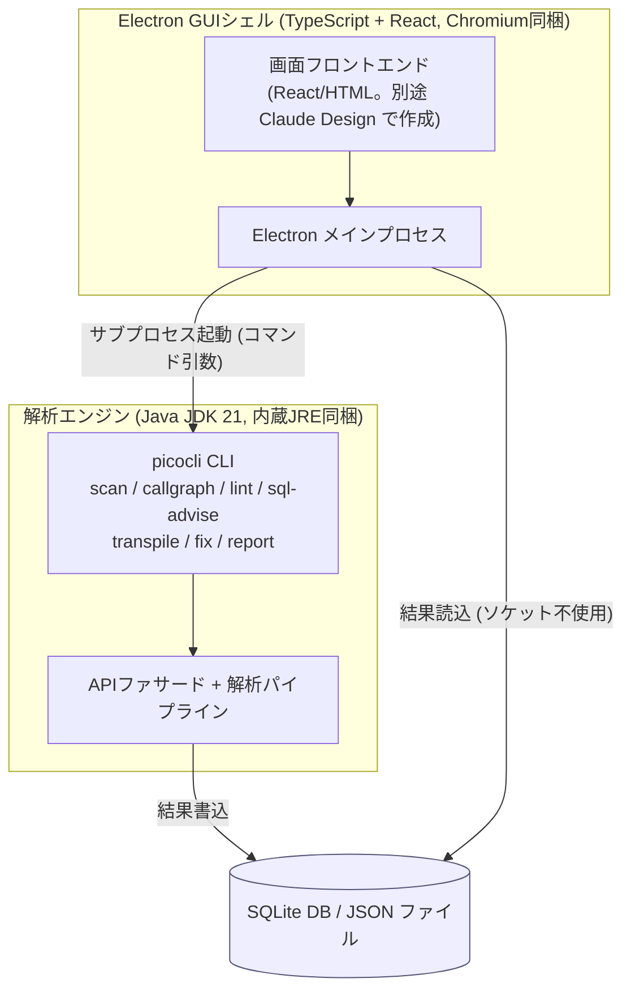
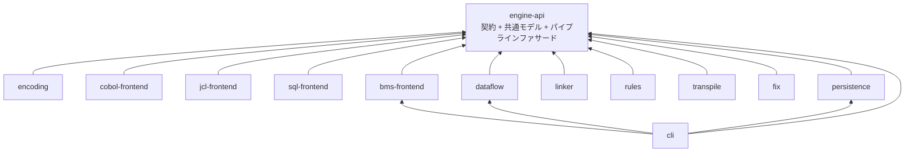
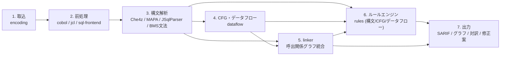
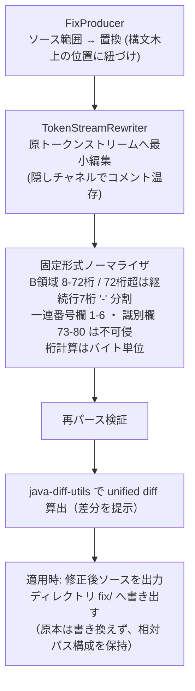

# 04 アーキテクチャ設計

本書は、本アプリケーション(COBOL Insight)の実行時構成、モジュール分割、解析パイプライン、主要データモデル、固定形式ソースへの往復修正機構、拡張点、およびエラー処理方針を定める。技術選定の根拠と採用OSSの比較は `03_技術選定.md` に、5機能の要件とバグ検出ルールカタログは `02_要件定義.md` に置く。本書はそれらの決定を前提として、内部構造の設計を確定する。

文書一式は次の5冊で構成する。

- `01_企画コンセプト.md`: 目的・提供価値と名称候補。
- `02_要件定義.md`: 5機能の要件、バグ検出31ルール・SQL助言6ルールのカタログ、`samples/` による検証要件。
- `03_技術選定.md`: 採用OSS資産の比較評価と最終スタックの決定根拠。
- `04_アーキテクチャ設計.md`: 本書。内部構造の設計。
- `05_開発計画.md`: モジュール実装順序、ルール段階導入、外部OSSの取り込み方針。

---

## 1. 全体構成

本アプリケーションは、Java(JDK 21 LTS)で実装した解析エンジンを中核とし、CLIとGUIの2経路から同一のエンジンを駆動する。エンジンは同一JVM内でCOBOL・JCL・埋め込みSQLを統合解析する。GUIとCLIはともに同じAPIファサードを通るため、両者の機能パリティを構造として保証する。

GUIシェルはElectron(TypeScript+React、Chromium同梱)である。GUIはJavaエンジンをpicocli CLIのサブプロセスとして起動し、結果をSQLiteデータベースおよびJSONファイル経由で受け取る。GUIとエンジンの間にループバックソケットを含む一切のネットワーク通信を置かない。これは、ローカルで完結するという既定の前提を、構造として守るためである。GUI画面のフロントエンド(React/HTML)は後日Claude Designで作成して取り込むものとし、画面コンポーネントの実装は本フェーズの対象外である。



配布は次の2形態を取る。CLIおよびエンジンは jpackage で内蔵JREを同梱したWindows app-imageとし、利用者が別途Javaをインストールする必要はない。GUIは electron-builder のZIPターゲットでポータブル配布物にまとめ、このapp-imageを内包する。ZIPを任意のフォルダへ展開して実行するだけで動作し、導入作業も管理者権限も要さない。設定・キャッシュ・ログの保存先は展開先直下の`data`フォルダである。図描画のCLI静的出力は graphviz-java によりJVM内で完結し、GUIの対話描画は Cytoscape.js + ELK.js レイアウトが担う。

---

## 2. Gradleマルチモジュール分割

エンジンはGradleマルチモジュール構成とする。各モジュールは単一責務を持ち、依存方向は共通契約モジュール `engine-api` へ一方向に収束する。フロントエンド・解析器・ルール・文字コード処理をインターフェース背後に置くことで、ルール追加やパーサーの差し替えを基底に触れず行える。

### 2.1 モジュール一覧

| モジュール | 責務 | 主な依存 |
| --- | --- | --- |
| `engine-api` | 共通契約(`CobolParser` / `JclParser` / `SqlParser` / `Rule` / `FixProducer` / `CharsetProvider` 各インターフェース)、共通データモデル(呼出関係グラフ、findings(検出結果)、行対応表、座標付きトークン、正規化意味モデル、BMSマップモデル)、解析パイプラインのファサード。 | なし(JDKのみ) |
| `encoding` | 文字コード判別・復号・原バイト保持。ICU4J + IBM930/939。`CharsetProvider` 実装。 | `engine-api` |
| `cobol-frontend` | Che4z(Eclipse Che4z COBOL Language Support。EPL-2.0、Java+ANTLR4)の `parser`・`engine` モジュールをソースからビルドして組み込み、COBOL構文・意味解析を行う。COPY/REPLACE展開、EXEC SQL抽出、EXEC CICS(CICS: Customer Information Control System、IBMのオンライントランザクション処理基盤)コマンド(SEND MAP・RECEIVE MAP・XCTL・LINK・START・RETURN TRANSID)の解析を行い、Che4zの出力(構文木・シンボル情報)を `engine-api` の正規化意味モデルへ写像する。`CobolParser` 実装。 | `engine-api` |
| `jcl-frontend` | MAPA(上流追従のソースビルド)によるJCL解析。JOB/EXEC/DD、カタログ化PROC展開、シンボリックパラメータ解決、ステップ/ジョブ両単位のCOND、IF/THEN/ELSE、JCLLIB、INCLUDE。`JclParser` 実装。 | `engine-api` |
| `sql-frontend` | JSqlParserによる埋め込みSQL解析と2段前処理(ブロック分離、ホスト変数の可逆マングリング、双方向マップによる原データ名復元)。`SqlParser` 実装。 | `engine-api` |
| `bms-frontend` | 自製のANTLR4文法によるBMS解析。BMSマクロ(DFHMSD・DFHMDI・DFHMDF)を解析し、マップセット・マップ・フィールド(名称・位置・長さ・属性)のモデルを構築し、`engine-api` のBMSマップモデルへ写像する。 | `engine-api` |
| `dataflow` | 制御フローグラフ(CFG)構築、GO TO正規化(Hendrenアルゴリズム)、共有単調不動点エンジン(到達定義・区間/値域・汚染追跡・生存)。 | `engine-api` |
| `linker` | 呼出関係グラフの統合。EXEC PGM=↔PROGRAM-ID対応、静的CALL解決、動的CALLの定数伝播解決、未解決ノード・外部ユーティリティノードの型付け。EXEC CICSのトランザクション遷移辺(XCTL・LINK・START・RETURN TRANSID)とマップ参照辺の追加、トランザクションID→プログラムの解決(トランザクション定義表とソース中の指定による)。 | `engine-api` |
| `rules` | ServiceLoaderで発見するルールプラグイン。構文・CFG・データフローの3段階でfindingsを算出し、各ルールが任意で `FixProducer` を提供する。SARIF(Static Analysis Results Interchange Format。静的解析結果の交換形式)出力。 | `engine-api` |
| `transpile` | Python/Javaへの決定論的・最適化なし逐語対訳。COBOL行と生成行の1:N・N:1対応表とGUIリンク用アンカーを生成。 | `engine-api` |
| `fix` | 修正案の固定形式ソースへの往復適用。TokenStreamRewriter + 固定形式ノーマライザ + 再パース検証 + 差分算出。 | `engine-api` |
| `persistence` | 埋め込みSQLite(sqlite-jdbc)への永続化と、内容ハッシュによる増分解析。 | `engine-api` |
| `cli` | picocliサブコマンド群。APIファサードを駆動する薄いmain入口。jpackageによる内蔵JRE同梱app-image化。ソースの復号(`encoding` の判別・復号の呼出し)を一括実施し、`DecodedSource` を各フロントエンドへ渡す。 | `engine-api`, `encoding`, `persistence`, `bms-frontend`(そのほかの実装各モジュールを実行時クラスパスに同梱) |

### 2.2 依存方向

コンパイル時の依存は全モジュールが `engine-api` へ収束する一方向グラフである。復号は `cli` の `ScanRunner` が `CharsetProvider` を通じて一括実施し、復号済みテキスト(`DecodedSource`)を各フロントエンドへ渡す。`cli` は `engine-api` のほか、保存先DAOを駆動する `persistence` と、`engine-api` にSPI契約が無いBMS解析を直接呼び出す `bms-frontend`、および制御フローグラフを直接構築する(`CfgBuilder`)ため `dataflow` へコンパイル依存を持つ。`cobol-frontend` はChe4zの `parser`・`engine` 層の出力(構文木・シンボル情報)を `engine-api` の正規化意味モデルへ写像するため、`dataflow`・`linker`・`transpile`・`rules` の下流解析は特定フロントエンドの具象型に依存しない。この写像層により、`CobolParser` の背後を別のCOBOL解析器へ差し替えても下流を再コンパイルせずに済む。



実装モジュールは `META-INF/services` を通じてServiceLoaderに登録する。`engine-api` のパイプラインファサードは各インターフェースを呼ぶだけであり、実装は実行時にServiceLoaderで束ねる。したがって `engine-api` は実装モジュールへコンパイル依存を持たず、`cli` が実行時クラスパスへ実装一式を同梱してパイプラインを成立させる。

---

## 3. 解析パイプライン

解析は7段の直列パイプラインとする。各段は前段の出力を入力とし、中間成果を `engine-api` の共通モデルとして受け渡す。逐語対訳(`transpile`)と修正往復(`fix`)は、構文解析とデータフローの成果を再利用する要求駆動のサブパイプラインである(第5章)。



各段の入出力を次に定める。

| 段 | 担当モジュール | 入力 | 出力 |
| --- | --- | --- | --- |
| 1. 取込 | `encoding` | ソースファイル/データセットの生バイト列 | 復号済みテキスト(内部UTF-16正規化)、原バイト列、バイトオフセット表、確定コードページ、手動指定オーバーライドの有無 |
| 2. 前処理 | `cobol-frontend` / `jcl-frontend` / `sql-frontend` | 復号済みテキスト | COPY/REPLACE展開後ソース、展開の対応表(展開行→元のコピーブック位置)、抽出済みEXEC SQL/EXEC CICSブロック、ホスト変数マングリングの双方向マップ、JCLのPROC展開・シンボリック解決後ソース |
| 3. 構文解析 | `cobol-frontend` / `jcl-frontend` / `sql-frontend` / `bms-frontend` | 展開後ソース、抽出SQL(マングリング済み)、BMSソース | 正規化意味モデル(Che4zの構文木・シンボル情報から構築)、JCLジョブ構造モデル、SQLパースツリー、BMSマップモデル、原ソース座標(行・桁・原バイトオフセット)を保持した座標付きトークンストリーム |
| 4. CFG・データフロー | `dataflow` | 正規化意味モデル(段落・文・手続き) | CFG、GO TO正規化後の制御フロー、データフロー事実(到達定義のdef-use、区間/値域、汚染集合、生存集合) |
| 5. linker | `linker` | JCLジョブ構造モデル、COBOLのPROGRAM-ID/CALL情報、動的CALLの値集合(段4由来)、EXEC CICSコマンド、BMSマップモデル、トランザクション定義表(任意入力のCSV) | 単一の呼出関係グラフ(ノード・エッジ、各エッジの解決根拠タグ。トランザクション遷移辺・マップ参照辺を含む) |
| 6. ルールエンジン | `rules` | 正規化意味モデルと座標付きトークン(構文段)、CFG(CFG段)、データフロー事実(データフロー段)、SQLパースツリーと抽出SQLテキスト、呼出関係グラフ、BMSマップモデルとEXEC CICS解析結果 | findings(SARIF)、各findingに紐づく任意の `FixProducer`(ソース範囲→置換) |
| 7. 出力 | `rules` / `linker` / `transpile` / `fix` / `persistence` | findings、呼出関係グラフ、行対応表、修正差分 | SARIFファイル、グラフ(JSON/DOT、graphviz-java SVG/PNG、Cytoscape.js対話描画)、逐語対訳と行対応表、unified diff。すべてSQLiteへ格納 |

GO TO正規化(段4)はHendrenらのアルゴリズムを用いる。入力は、段落・文からGO TO分岐を含めて構築した制御フローグラフである。単一入口の入れ子構造へ還元できない分岐(可約でない分岐)について、その分岐先の到達ノードを必要な範囲で複製し、各経路を単一入口の領域へ分割する。出力は、元の実行順序を保ったまま順次・分岐・反復の入れ子へ構造化した制御フローグラフであり、後段のデータフロー解析(段4)と逐語対訳の構造化(第5章・4.3節)に用いる。

<!-- Erosa, Hendren. Taming Control Flow: A Structured Approach to Eliminating Goto Statements. ICCL 1994. DOI:10.1109/ICCL.1994.288377 -->

ルールエンジンは解析深度で3段階に分ける。第1段は構文のみに依存する7件で、制御フローグラフ・データフローを待たずに評価できる。第2段は制御フローグラフ、またはBMSマップモデルとEXEC CICS解析結果の突合に依存する13件、第3段は手続き間データフローに依存する11件である。バグ検出ルールは計31件である。CICSのマップ参照検査(R031。存在しないBMSマップ・フィールドの参照)は第2段に属し、BMSマップモデルとEXEC CICS解析結果の突合で判定する。SQL助言6ルールは構文レベル(EXPLAIN・カタログ非依存)に限定し、JSqlParserが届かないDb2固有句(OPTIMIZE FOR、WITH URの2句に限る)は抽出SQLテキストへのトークン・正規表現検査で補う。個々のルール定義は `02_要件定義.md` に置く。

---

## 4. 主要データモデル

### 4.1 呼出関係グラフ

呼出関係グラフは機能(1)の正本であり、JSONとDOTの双方へ直列化できる単一モデルである。ノードは種別を持ち、エッジは呼出・実行・参照・トランザクション遷移・マップ参照の関係と解決根拠を持つ。

ノード種別は次のとおりとする。

| ノード種別 | 意味 |
| --- | --- |
| ジョブ | JCLのJOB単位 |
| ステップ | JCLのEXECステップ単位 |
| プログラム | COBOLプログラム(PROGRAM-ID) |
| 段落 | COBOLの段落・節 |
| データセット | DD文が参照するデータセット |
| Db2表 | 埋め込みSQLが参照するDb2の表・ビュー |
| 未解決 | 定数伝播で解決できない動的CALL先(指定変数名を保持) |
| 外部ユーティリティ | DFSORT・IDCAMS・IEBGENERの3種、およびPL/I・アセンブラの外部リーフ(種別タグ付き) |
| トランザクション | CICSトランザクション(トランザクションID) |
| BMSマップ | BMSのマップセット・マップ(SEND MAP・RECEIVE MAPが参照する画面定義) |

エッジは解決根拠(定数由来・データフロー由来・未解決)を保持する。動的CALLは定数伝播・def-use・値集合解析で候補を解決し、解決できないものは変数名付きの未解決ノードとしてグラフに残す。これにより、グラフの完全性・精度と、過大な主張を避ける透明性を両立する。解決根拠はfindingsにも記録する。

トランザクション遷移辺は、EXEC CICSのXCTL・LINK・START・RETURN TRANSIDから作り、疑似会話フロー(RETURN TRANSIDが指定する次トランザクション)を辺として表す。マップ参照辺は、SEND MAP・RECEIVE MAPが参照するBMSマップへ張る。トランザクションIDからプログラムへの解決は、任意入力のトランザクション定義表(CSV。列はトランザクションIDとプログラム名)とソース中の指定から行い、解決できないトランザクションは未解決ノードとして残す。

### 4.2 findings(SARIF準拠)

検出結果(findings)はSARIF 2.1.0に準拠する。各findingは、ルールID、レベル(error / warning / note)、メッセージ、物理位置(artifact URI と region: 開始行・開始桁・原バイトオフセット)を持つ。汚染追跡由来のfindingはcodeFlowsで経路を保持する。`FixProducer` を持つルールはfixes(artifactChangesのソース範囲置換)を付す。コードスメル寄りのルール(GO TOの使用、同一式の重複の2件)は既定severityをwarningとする。全ルールを既定で有効とし、利用者はルール単位で無効化できる。

### 4.3 行対応表

逐語対訳は、COBOL行と生成行(Python/Java)の対応を1:N・N:1の双方向で保持する。GUIは対応表のアンカーIDで両ソースを相互リンクする。

| フィールド | 内容 |
| --- | --- |
| cobolSourceId | 対象COBOLソースの識別子 |
| cobolLineRange | COBOL側の行範囲 |
| generatedFile | 生成先ファイル(Python/Java) |
| generatedLineRange | 生成側の行範囲 |
| mappingKind | 対応種別(1:1 / 1:N / N:1) |
| note | 直訳不能構文(GO TO・REDEFINESを含め、transpileモジュールが対訳規則で直訳不能と判定した全構文)の注記 |
| anchorId | GUIリンク用アンカー |

GO TOの構造化は制御フローグラフと中間表現(IR)、Hendrenアルゴリズムにより行い、REDEFINESはバイト列とget/setアクセサ方式で表現する。直訳不能な構文は、注記付きで、COBOL複数行を生成側1行へ対応させる可視化(N:1)により提示する。

### 4.4 SQLiteスキーマ概要

永続化は埋め込みSQLiteの1ファイルとする。呼出関係グラフを隣接ノード/エッジ表で表現し、到達性は再帰CTEまたはエンジン内計算で得る。トランザクション遷移辺・マップ参照辺は `CALL_EDGE` の種別で、BMSマップモデルは専用の表(BMS_MAPSET・BMS_MAP・BMS_FIELD)で同一データベースへ格納する。ソース単位の内容ハッシュにより、変更されたメンバとその依存だけを再解析する。

```mermaid
erDiagram
  SOURCE ||--o{ PROGRAM : contains
  SOURCE ||--|| ENCODING_INFO : has
  SOURCE ||--o{ SQL_STMT : embeds
  SOURCE ||--o{ FINDING : locates
  SOURCE ||--o{ LINE_MAP : maps
  PROGRAM ||--o{ PARAGRAPH : contains
  NODE ||--o{ CALL_EDGE : from
  NODE ||--o{ CALL_EDGE : to
  BMS_MAPSET ||--o{ BMS_MAP : contains
  BMS_MAP ||--o{ BMS_FIELD : contains

  SOURCE {
    int id PK
    text path
    text codepage
    text content_hash
    int byte_size
  }
  ENCODING_INFO {
    int source_id FK
    text detected_charset
    real confidence
    int manual_override
    int so_si_present "SO/SI(シフトアウト/シフトイン)制御文字の検出有無"
  }
  BMS_MAPSET {
    int id PK
    int source_id FK
    text name
  }
  BMS_MAP {
    int id PK
    int mapset_id FK
    text name
    int size_rows
    int size_cols
  }
  BMS_FIELD {
    int id PK
    int map_id FK
    text name
    int pos_row
    int pos_col
    int length
    text attrb
  }
  PROGRAM {
    int id PK
    int source_id FK
    text program_id_name
  }
  PARAGRAPH {
    int id PK
    int program_id FK
    text name
    int start_line
    int end_line
  }
  NODE {
    int id PK
    text type
    text label
  }
  CALL_EDGE {
    int id PK
    int from_node FK
    int to_node FK
    text kind
    text resolution
    text host_var
  }
  FINDING {
    int id PK
    text rule_id
    text level
    int source_id FK
    int start_line
    int start_col
    int byte_offset
    text message
    text sarif_json
  }
  SQL_STMT {
    int id PK
    int source_id FK
    text stmt_type
    text mangled_text
    text original_text
  }
  LINE_MAP {
    int id PK
    int cobol_source_id FK
    int cobol_line_start
    int cobol_line_end
    text gen_file
    int gen_line_start
    int gen_line_end
    text kind
    text anchor_id
  }
```

### 4.5 正規化意味モデル

正規化意味モデルは、`cobol-frontend` がChe4zの出力(構文木・シンボル情報)から構築する、下流解析共通の中間モデルである。`dataflow`・`linker`・`transpile`・`rules` はこのモデルだけを入力とし、特定フロントエンドの具象型に依存しない。構成要素は次のとおりとする。

| 構成要素 | 保持する情報 |
| --- | --- |
| データ項目 | 定義・再定義(REDEFINES)・レベル番号・PICTURE・用途(USAGE)。集団項目と基本項目の親子関係。 |
| 段落・節と制御構造 | 段落・節の定義、手続き部の各文、順次・分岐・反復・GO TOの制御構造。 |
| CALL・PERFORM関係 | プログラム間のCALL(静的・動的の別と指定内容)、段落・節へのPERFORM(THRU範囲を含む)。 |
| 埋め込みブロック | EXEC SQLブロック、EXEC CICSコマンド(SEND MAP・RECEIVE MAP・XCTL・LINK・START・RETURN TRANSID)。抽出テキストと種別。 |
| ソース位置 | 各要素の元ファイル・行・桁。COPY/REPLACE展開の対応(展開後の位置と元のコピーブック位置の対応)。 |

各要素は原ソース座標を保持し、findings・行対応表・呼出関係グラフはこの座標で相互に対応づける。第1マイルストーン(M1)で、Che4zの意味情報API(シンボル・型情報)から、このモデルの構成要素(データ項目・段落と制御構造・CALL/PERFORM関係・埋め込みブロック・ソース位置)を欠落なく構築できるかを、`samples/` 配下の資産で実地に検証する。

### 4.6 BMSマップモデルとCICS解析

BMS(Basic Mapping Support)の画面定義は、`bms-frontend` が自製のANTLR4文法でBMSマクロ(DFHMSD・DFHMDI・DFHMDF)を解析し、マップセット・マップ・フィールドの階層モデルとして保持する。

| 構成要素 | 保持する情報 |
| --- | --- |
| マップセット | DFHMSDが定義する単位。名称と、含むマップの集合。 |
| マップ | DFHMDIが定義する画面。名称、画面上の位置・大きさ、含むフィールドの集合。 |
| フィールド | DFHMDFが定義する項目。名称、位置(行・桁)、長さ、属性。 |

COBOL側は、EXEC CICSコマンド(SEND MAP・RECEIVE MAP・XCTL・LINK・START・RETURN TRANSID)を正規化意味モデルへ取り込む。`linker` は、これらのコマンドからトランザクション遷移辺とマップ参照辺を呼出関係グラフへ加える(4.1節)。

存在しないBMSマップ・フィールドの参照を検出するルール(R031)は、BMSマップモデルと、SEND MAP・RECEIVE MAPが参照するマップ・フィールドを突き合わせて判定する。この突合はルールエンジンの第2段で行う。

---

## 5. 固定形式往復修正パイプライン

修正案生成(機能4)は、変更後ソースを生成する。生成ソースの固定形式資産への書き戻しは、桁ずれやコンパイル不能を招きやすい。これを避けるため、抽象構文木(AST)からの再印字を禁止し、原トークンストリームへの最小編集のみを適用する。修正案は必ず差分(diff)として提示する。

各ルールが任意で提供する `FixProducer` は、構文木上の位置に紐づく最小編集(ソース範囲→置換)を返す。適用はANTLRのTokenStreamRewriterで原ソースのトークンストリームへ行い、隠しチャネルのコメントを含む未変更トークンを完全に温存する。固定形式ノーマライザは、変更した物理行にのみ桁規則(B領域8〜72桁、72桁を超える行は継続行として7桁目`-`へ分割、一連番号欄1〜6桁と識別欄73〜80桁は不可侵)を強制する。桁計算はDBCS(Double Byte Character Set、2バイト文字集合)混在に備え全面をバイト単位で行う。



修正案は差分として提示し、適用するかは利用者が判断する。適用しても原本ファイルは一切書き換えず、修正後ソースを、元の相対パス構成を保った出力ディレクトリ(既定 `fix/`)へ書き出す。修正箇所がコピーブックの中にある場合も同様に差分を提示し、そのコピーブックを取り込む全プログラムの一覧を併せて示す。これにより、1か所の修正が波及する範囲を利用者が把握できる。往復の忠実性は「パース→無編集リライトでバイト一致」のゴールデンテストで保証する。すなわち、いかなる編集も加えずにリライトした出力ファイルが原本のバイト列と一致することを必須ゲートとする。適用後は必ず再パースして検証する。

自動で修正案を生成するのは定型的な修正を持つルールに限る(ON SIZE ERROR付与、FILE STATUS検査挿入、SQLCODE検査挿入、RESP/RESP2検査挿入の4件)。判断を要するルール(未初期化の是正、汚染SQLの是正の2件に限る)は助言のみとし、自動適用しない。差分計算はエンジン内の java-diff-utils に一元化し、GUIのMonaco Editor diffとCLIのANSI unified diff / diff2html静的HTMLで同一結果を提示する。

---

## 6. 拡張点

拡張は、差し替え・追加の必要性がすでに確定している箇所に限定する。投機的な抽象化は設けない。

- **ルールプラグイン**: バグ検出・SQL助言のルールは `Rule` インターフェースの実装であり、`META-INF/services` で登録してServiceLoaderが発見する。ルール追加はクラス1個の追加で完結し、基底に触れない。各ルールは任意で `FixProducer` を伴う。
- **フロントエンド差し替え**: `CobolParser` / `JclParser` / `SqlParser` の各インターフェースの背後を差し替えられる。COBOLフロントエンドはChe4zの出力を正規化意味モデルへ写像する構成であり、この写像層により、別のCOBOL解析器へ差し替えても下流の `dataflow`・`linker`・`transpile`・`rules` を再コンパイルせずに済む。
- **対訳・修正案生成器の差し替え**: 逐語対訳と修正案生成は決定論的ルールベースで行う。生成器を差し替え可能なインターフェースとして設け、将来ローカルLLMへ置き換えられる余地だけを残す。v1ではローカルLLMを使わない。

---

## 7. エラー処理・部分失敗の方針

解析はファイル単位を独立した処理単位とする。1ファイルのパース失敗が解析全体を止めない。解析エンジンは、失敗したファイルをerrorレベルのfinding(パース失敗)として記録し、残りのファイルの解析を継続する。成果物は部分的なグラフと部分的なfindingsとして出力する。

linkerは、解析できなかったプログラムを「解析不能」ノードとして呼出関係グラフに残す。これにより、失敗を隠さず可視化し、グラフの透明性を保つ。文字コードのEBCDIC自動判別は本質的に不確実であるため、初期推定に留める。そのため、ファイル/データセット単位のコードページ手動指定をCLIフラグとGUI設定で常時提供する。復号直後のプレビューで人間が判別結果を確認でき、原バイト保持により再判別が可能である。

CLIの終了コードは、成功=0・警告あり=1・エラー=2とし、CI(継続的インテグレーション)から判定できるようにする。増分解析では、内容ハッシュが変化したメンバのみを再処理するため、失敗メンバの修正後に当該メンバとその依存だけを再試行できる。IBM Enterprise COBOL構文の妥当性検証には GnuCOBOL(cobc -std=ibm)を外部プロセスとして併用し、ライセンス波及を外部コマンド呼出に限定する。
