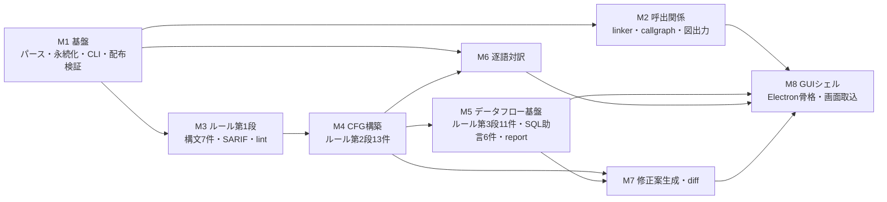

# 05 開発計画

本アプリケーション（COBOL Insight）は、IBM Enterprise COBOL・MVS JCL・埋め込みDb2 SQLを対象とする
Windows 11ローカル完結の静的解析支援ツールである。本書は、その実装を段階に分割した
マイルストーン、各段階の検証可能な完了条件、検証方針、体制上の前提を定める。技術構成の根拠と却下理由は `03_技術選定.md` を正本とし、
本書は選定済みの構成を実装順序へ落とし込む。

## 1. 本書の位置づけ

文書一式は次の6冊で構成する。本書は各冊を参照するにとどめ、内容を転記しない。

| 文書 | 担当範囲の要約 |
|---|---|
| `01_企画コンセプト.md` | 本アプリケーションの狙い・価値・想定利用者と、名称の由来。 |
| `02_要件定義.md` | 5機能(呼出関係図示・バグ検出・SQL助言・修正案生成とdiff表示・逐語対訳)の機能要件と、非機能要件・入出力仕様・受入基準。 |
| `03_技術選定.md` | コア言語Javaと、COBOL/JCL/BMS/SQL解析・GUI・図描画・永続化の各OSSの採否と却下理由。技術構成の正本。 |
| `04_アーキテクチャ設計.md` | Gradleマルチモジュール構成、データモデル、解析パイプライン、インターフェース境界。 |
| `05_開発計画.md`(本書) | マイルストーン分割、完了条件、検証方針、体制上の前提。 |
| `06_ルールカタログ.md` | バグ検出ルール31件とSQL最適化助言ルール6件の正本。 |

技術構成の要点として、コアはJava(JDK 21 LTS)単一とし、COBOL構文解析にEclipse Che4z COBOL
Language Supportを用いる。その意味情報の粒度が要件に届かない部分は、構文木から正規化意味
モデルを構築して補う。JCLはMAPA、SQLはJSqlParser(ホスト変数の可逆マングリング付き)を
同一JVMへ統合し、GUIシェルのみTypeScript(Electron)とする。ルールはServiceLoaderによる
プラグイン(1ルール=1クラス)として追加できる。工数見積りは、この構成(技術選定の提案3)で
1.5〜2年である。

## 2. マイルストーン全体像

M1で解析基盤・永続化・CLI・配布検証を先に固め、以降は解析深度の浅い機能から順に積む。
バグ検出ルールは解析深度で3段階に分け、構文のみで判定する7件を第1段、制御フロー(CFG)に
依存する13件を第2段、データフローに依存する11件を第3段として段階的に導入する。合計31ルールと
SQL助言6ルールを対象とする。

### 2.1 サンプル欠陥の検出段階対応

完了条件の検証オラクルは `samples/期待結果.md` の正解データである。同書は9種別・計15件の
欠陥と、JCL→プログラム→サブルーチン→データセットの呼出関係の正解を収録する。各欠陥種別は、
それを検出する`06_ルールカタログ.md`所定のルールが属する解析段階に対応するマイルストーンの
完了条件とする。第1段のルールが検出する欠陥種別はM3、第2段のルールが検出する欠陥種別はM4、
第3段のルールが検出する欠陥種別はM5の完了条件の基準とする。

| 欠陥種別(件数) | 該当欠陥No. | 検出ルール | 要する解析 | 検出段階 |
|---|---|---|---|---|
| 使われない変数(1) | 8 | R002 | 構文(記号表・参照有無) | M3 |
| ファイルステータス未検査(2) | 4, 6 | R017 | CFG(入出力文実行後、後続の分岐・IF文でのFILE STATUS検査の有無) | M4 |
| SQLCODE未検査(2) | 12, 15 | R018 | CFG(EXEC SQL実行後、後続処理でのSQLCODE検査の有無) | M4 |
| PERFORM THRUの範囲へ割り込むGO TO(1) | 7 | R007 | CFG(実行範囲と分岐先) | M4 |
| 到達不能コード(1) | 11 | R011 | CFG(到達性) | M4 |
| 使われない段落(1) | 10 | R011 | CFG・呼出解析(PERFORM/GO TO到達性) | M4 |
| ON SIZE ERROR欠如の演算(1) | 14 | R004 | データフロー(演算のオーバーフロー可能性の値域解析、およびON SIZE ERROR句の有無) | M5 |
| 未初期化変数の参照(2) | 1, 9 | R001 | データフロー(到達定義) | M5 |
| MOVEでの桁落ち・切り捨て(2) | 2, 5 | R003 | データフロー(区間・値域) | M5 |
| OCCURS範囲外になり得る添字(2) | 3, 13 | R005 | データフロー(区間) | M5 |

M3で1件、M4で7件、M5で7件を検出し、M5完了時点で15件全件を `期待結果.md` の
ファイル・行番号どおりに検出する。

表の「使われない変数」と「使われない段落」は、`samples/期待結果.md`の欠陥種別内訳では
「使われない変数・段落」としてまとめて1種別(9種別のうちの1つ)に数える。検出ルールと要する
解析が異なる(前者はR002・構文、後者はR011・CFG)ため、本表では2行に分けて示す。

## 3. マイルストーン詳細

各マイルストーンに、目的・スコープ・成果物・完了条件を定める。完了条件は測定可能な事実で
記述し、達成の可否を二値で判定できるようにする。

### 3.1 M1 基盤

目的は、以降の全機能が乗る解析基盤・永続化・CLI入口を確立し、あわせて配布構成を実装
着手前に実機で検証することにある。配布検証を先行するのは、署名なし配布とElectron+内蔵
JREの二重ランタイム構成が実機Windows 11で問題なく動作することを早期に確かめ、SmartScreen
警告への対処手順を導入手順書へ反映するためである。

スコープ:

- リポジトリ初期化とGradleマルチモジュール構成(`04_アーキテクチャ設計.md` のモジュール分割に従う)。JDK 21 toolchainを固定する。
- COBOLパーサーのEclipse Che4z COBOL Language Support(EPL-2.0)を上流ソースからビルドして取り込み、JCLパーサーのMAPA(MIT)を上流リリースに追従してソースからビルドする。各ライセンス表記を保持し、上流依存を含めてオフライン(無ネットワーク)でビルドできる状態にする。あわせてChe4zの意味情報APIの粒度を実地に検証し、要件に届かない場合は構文木から正規化意味モデルを構築して補う。
- encodingモジュール。ICU4JでUTF-8/Shift_JISを判別し、EBCDIC(CP930/939)はバイト分布とSO/SI検出で推定し、復号はIBM930/939を用いる。ファイル/データセット単位のコードページ手動指定をCLIフラグで提供する。
- 次の6処理を実装する。(1)COBOL/JCL/SQLのパース。(2)COPY/REPLACE展開。(3)EXEC SQLブロック抽出。(4)ホスト変数の可逆マングリング。(5)BMSマップ定義(DFHMSD/DFHMDI/DFHMDF)の自製ANTLR4文法によるパース。(6)EXEC CICSコマンドの抽出。
- 解析結果のSQLite永続化。プログラム・段落・呼出エッジ・検出結果・SQL文・行対応・エンコーディング情報の各表を定義する。
- CLI `scan` サブコマンド(picocli)。
- 配布検証の先行実施。jpackageによる内蔵JRE同梱app-imageと、electron-builder+NSISの最小パッケージング骨格を作り、実機Windows 11でインストーラを生成・起動し、SmartScreen挙動・配布サイズ・起動時間を数値と事実で記録する。配布は署名なしとし、SmartScreen警告への対処手順を導入手順書として作成する。

完了条件:

- `gradlew build` がオフラインで成功し、Che4z(EPL-2.0)とMAPA(MIT)のライセンスファイルが配布物に含まれる。
- `scan samples/` が、JCL3本・COBOL9本・コピー句3本・BMSマップ1本をエラーなくパースする。COPY/REPLACE展開が `期待結果.md` 6章のとおり動作し、SYKCPY1.cpyが `SYK1-` → `ORD1-`(SYK001)・`SYK1-` → `IN1-`(SYK002)へ置換され、SYK003では置換されずに展開される。
- SYK006.cbl・SYK007.cbl のEXEC SQLブロックを抽出し、ハイフン入りホスト変数(例 `:WS-...`)を可逆マングリングして原データ名へ復元できる。往復で原データ名が一致することを単体テストで確認する。
- SYK008.cbl・SYK009.cblのEXEC CICSコマンドと、SYKMAP1.bmsのマップ定義(マップ名・フィールド名)を抽出できる。
- encodingモジュールが `samples/encoding/SYKENC1_UTF8.cbl` と `SYKENC1_SJIS.cbl` を同一のUTF-16正規化文字列へ復号する(`期待結果.md` 7.1: UTF-8側1,003文字・Shift_JIS側1,144バイト)。EBCDIC復号はsamples/にEBCDIC資産が無い(`期待結果.md` 7.2)ため、SO/SIシフトを含む合成CP930/939バイト列のfixtureで検証する。CLIのコードページ手動指定フラグが判別結果を上書きできる。
- `scan` の結果がSQLiteの各表へ格納され、内容ハッシュによる増分解析で変更メンバのみ再解析される。
- 実機Windows 11でインストーラを起動し、配布サイズ・起動時間・SmartScreen挙動を数値と事実で記録する。署名なし配布でのSmartScreen警告への対処手順を導入手順書へまとめる。

### 3.2 M2 呼出関係(機能1)

目的は、JCL→プログラム→サブルーチン→データセットの呼出関係を単一のグラフモデルとして
構築し、図として出力することにある。

スコープ:

- linkerモジュール。JCLの `EXEC PGM=` とCOBOLの `PROGRAM-ID` を対応づけ、静的CALLのリテラルを解決し、動的CALL(変数指定)を定数伝播・def-useで解決候補に絞り込む。解決不能なCALL先は変数名付きの「未解決(動的)」境界ノード、DFSORT・IDCAMS・IEBGENERのユーティリティは種別タグ付き外部リーフノードとする。
- コピーブックの探索パスによるファイル横断解決。
- ステップ間・ジョブ間のデータセット連携の解決。
- EXEC CICSコマンドによる呼出関係の拡張。次の3処理を行う。(1)XCTL・LINK・START・RETURN TRANSIDからトランザクション遷移と疑似会話遷移を抽出する。(2)SEND MAP・RECEIVE MAPからBMSマップ参照を抽出する。(3)トランザクション定義表(`samples/cics/トランザクション定義表.csv`)でトランザクションID→プログラムを解決し、グラフへ加える。
- CLI `callgraph` サブコマンド。単一グラフモデルをJSON/DOTで出力し、graphviz-java(JVM内)でSVG/PNGを生成する。

完了条件:

- 生成した呼出関係グラフが `期待結果.md` 4〜5章と一致する。具体的には、SYKD010(STEP010→SYK001、STEP020→SYK002)、SYKD020(STEP010→SYK006、STEP020はインストリームPROC SYKPRC01経由でSYK007)、SYKD030(STEP010→SYK001、STEP020→SYK002)のPGM対応を解決する。
- 静的CALL SYK001→SYK003(SYK001.cbl 110行目)を解決する。動的CALL SYK002→SYK004(WS-PROG-NAMEに71行目で'SYK004'を設定、114行目でCALL)を定数伝播で解決し、解決根拠(定数由来)をfindingsに記録する。静的CALL SYK006→SYK005(133・142行目)を解決する。
- ステップ間連携(SYKD010のSTEP010出力 `ORDER.VALID` がSTEP020入力)、ジョブ間連携(SYKD010の `ORDER.ERROR` がSYKD030の入力)、共有VSAM(`SYKV.ORDER.MASTER`)を `期待結果.md` 4章のとおりエッジ化する。
- シンボリックパラメータ `&CYCLE`(`SET CYCLE=250718`)を解決し、データセット名の `&CYCLE` 部分を `250718` に置換する。
- 「未解決(動的)」ノードと種別タグ付きユーティリティリーフはsamples/に該当資産が無いため、合成fixtureの単体テストで型付けを検証する。
- SYK008.cbl・SYK009.cblのEXEC CICSコマンドから、トランザクション定義表CSVを用いてトランザクション遷移・疑似会話遷移・BMSマップ参照を解決し、呼出関係グラフへ加える。
- `callgraph` がgraphviz-javaのみでSVG/PNGを生成し、外部ネイティブバイナリを要しない。

### 3.3 M3 ルール第1段(構文のみ7件)+ SARIF + lint

目的は、構文解析だけで判定できる7ルールにより、早期に効果を出し、SARIF出力とCI向け入口を
確立することにある。ルールはServiceLoaderで発見するプラグイン(1ルール=1クラス)として実装する。

スコープ:

- 構文のみで判定する7ルールを実装する。R002未使用データ項目、R006添字への二進項目未使用、R008 PERFORM単独段落名の直接指定、R013 EVALUATE文のWHEN OTHER欠如、R023パラグラフ・セクション名の重複、R024 COPY REPLACINGによる置換漏れ、R026ハードコードされたパスワード・認証情報の7件である。ルールの個別仕様は`06_ルールカタログ.md`を正本とする。
- findingsのSARIF 2.1.0出力。
- CLI `lint` サブコマンド。CI向けの終了コードを備える。
- コードスメル寄りルール(R009 GO TO・R025 同一式の2件)の既定severityを警告とする仕組みを組み込む。全ルールを既定で有効とし、利用者がルール単位で無効化できる。

完了条件:

- samples/への `lint` が、M3対応の1欠陥(No.8の使われない変数)を、`期待結果.md` のファイル・行番号どおりに検出する。
- samples/に該当する意図的欠陥の無いルールは、各ルールの判定対象構文を含む合成fixtureの単体テストで検出を確認する。
- SARIF出力がSARIF 2.1.0スキーマ検証を通過する。
- M3対応ルールを模擬資産へ通し、期待した検出が全件出ること、および期待しない検出が出ないことを確認する。誤検出の数値許容水準は定めない。
- `lint` の終了コードが検出結果に応じて分岐する。

### 3.4 M4 CFG構築 + ルール第2段(13件)

目的は、制御フローグラフを構築し、GO TOを正規化したうえで、CFGに依存する13ルールを
導入することにある。

スコープ:

- CFG構築モジュール。GO TO正規化はHendrenアルゴリズム(GO TOによる不規則な分岐先のノードを複製し、単一入口の構造化された制御フローへ変換する手法。詳細は`04_アーキテクチャ設計.md`)を用い、cobol-rekt(MIT)のCFG/IRを設計時の参照とする(Che4zパーサーには依存しない)。
- CFG依存の13ルールを実装する。PERFORM THRU範囲への割り込みGO TO(R007)、到達不能コード・使われない段落(R011)、CICS応答コード(RESP/RESP2)未検査(R021)、CICS RETURN欠如(R022)、存在しないBMSマップ・フィールドの参照(R031)を含む。

完了条件:

- 9本のCOBOL全てでCFGを構築し、GO TOを正規化する。
- M4対応の7欠陥を `期待結果.md` の行番号どおりに検出する。No.4(SYK001.cbl 85行目)・No.6(SYK002.cbl 130行目)のファイルステータス未検査、No.12(SYK006.cbl 119行目)・No.15(SYK007.cbl 89行目)のSQLCODE未検査、No.7(SYK002.cbl 125行目、PERFORM THRU範囲外からの割り込みGO TO)、No.11(SYK005.cbl 40行目、GOBACK直後の到達不能DISPLAY)、No.10(SYK004.cbl 47〜49行目、どのPERFORM/GO TOからも呼ばれない9999-未使用処理)を検出する。
- CICS検証資産(`samples/bms/SYKMAP1.bms`、`samples/cobol/SYK008.cbl`・`SYK009.cbl`、`samples/cics/トランザクション定義表.csv`)へ第2段ルールを通し、CICS応答コード未検査(R021)を1件、CICS RETURN欠如(R022)を1件、存在しないBMSマップ・フィールドの参照(R031)を1件検出する。
- `期待結果.md`に対応する欠陥が無いその他のルールは、各ルールの判定対象構文を含む合成fixtureの単体テストで検出を確認する。
- MAPAのIF/THEN/ELSE・CONDが実行時リターンコードに依存し静的に一意化できない箇所は、両分岐を「発生し得る経路」として提示する。
- M3・M4のルールをsamples/へ通し、M4完了時点で計8欠陥(M3の1件+M4の7件)を検出する回帰テストが緑になる。

### 3.5 M5 データフロー基盤 + ルール第3段(11件)+ SQL助言(6件)

目的は、手続き間データフロー基盤を構築し、これに依存する11ルールとSQL助言6ルールを
導入して、バグ検出を完成させることにある。

スコープ:

- 共有単調不動点エンジン。到達定義・区間/値域・汚染追跡・生存を1つのエンジンで扱い、31ルールが要求する解析のみに絞る(汎用拡張フレームワークは作らない)。
- データフロー依存の11ルールを実装する。未初期化変数の参照(R001)、MOVEでの桁落ち・切り捨て(R003)、ON SIZE ERROR句の欠如(R004)、OCCURS範囲外アクセス(R005)、無限ループ(R012)、REDEFINESの項目長・境界の不一致(R015)、STRING/UNSTRINGの受信領域あふれ(R016)、動的SQLへの外部入力の未検証組み込み(R020)、二項演算子の両辺が同一の式(R025)、機密データ項目のマスキングなし出力(R027)、符号なし項目への負値算出(R028)の11件である。
- SQL助言6ルール。構文レベル(EXPLAIN・カタログ非依存)に限定する。JSqlParserが届かないDb2固有句(OPTIMIZE FOR・WITH URの2句に限る)は抽出SQLテキストのトークン/正規表現検査で補う。SQL助言はCLI `sql-advise` サブコマンドとして提供する。
- CLI `report` サブコマンド(FR-07)。scan・lint・sql-advise・callgraphの結果を統合したHTML/テキストのレポートを生成する。M5完了時点でscan・lint・sql-advise・callgraphが揃うため、本マイルストーンで実装する。

完了条件:

- M5対応の7欠陥を `期待結果.md` の行番号どおりに検出する。No.14(SYK007.cbl 79行目)のON SIZE ERROR欠如、No.1(SYK001.cbl 121行目)・No.9(SYK004.cbl 41行目)の未初期化変数参照、No.2(SYK001.cbl 128行目)・No.5(SYK002.cbl 118行目)の桁落ち、No.3(SYK001.cbl 114行目)・No.13(SYK006.cbl 139行目)のOCCURS範囲外を検出する。
- M3〜M5の全ルールをsamples/へ通し、`期待結果.md` の9種別15件を過不足なく検出する回帰テストが緑になる。期待した検出が全件出ること、および期待しない検出が出ないことをもって合格とし、誤検出の数値許容水準は定めない。
- SQL助言6ルールをSYK006.cbl・SYK007.cbl の埋め込みSQL(カーソル `SYKZAIKOCUR`・SELECT INTO・UPDATE・INSERT)へ適用し、構文レベルの助言を出力する。カタログ依存の助言は将来拡張とし、v1のスコープ外であることを明記する。
- `report` がsamples/の解析結果を統合したHTML/テキストのレポートを生成し、検出結果一覧・呼出関係の要約・SQL助言を含む。

### 3.6 M6 逐語対訳(機能5)

目的は、COBOL各行を最適化なしでPython/Javaへ決定論的に逐語対訳し、行単位で相互リンク
できるようにすることにある。

スコープ:

- Che4zの構文木と正規化意味モデル上の、決定論的で最適化を行わないルールベース変換層。PERFORM/GO TO/REDEFINES/COMP-3/88レベル/ファイルI-Oを構文別ルールとして実装する。逐語対訳はCLI `transpile` サブコマンドとして提供する。
- v1は完全に決定論的に動作する。将来のAI導入に備え、変換の生成点にアダプタの接続点だけを設ける。
- COBOL行↔生成行(1:N・N:1)の対応表と、GUIリンク用アンカーの生成。
- GO TO構造化はM4のCFG/IRとHendrenアルゴリズム、REDEFINESはバイト列+get/setアクセサ方式を用いる。

完了条件:

- 9本のCOBOLをPythonとJavaの双方へ変換し、同一入力に対して生成物がバイト単位で一致する(ゴールデンテスト)。EXEC CICSブロックは直訳不能構文として注記付きで対応表に載る。
- SYKCPY1.cpyのREDEFINES(10行目)・OCCURS(17〜18行目)・COMP-3・88レベル(24〜26行目)が、バイト列+アクセサ方式で対訳される。
- GO TO・REDEFINES・EXEC CICSの直訳不能構文が注記付き・N:1可視化で提示される。
- COBOL行と生成行の対応表が全行について生成され、アンカーで相互参照できる。

### 3.7 M7 修正案生成 + diff(機能4)

目的は、ルールが返す最小編集を固定形式ソースへ桁破壊なく往復適用し、diffで提示する
ことにある。提案のみとし、適用にはユーザー操作を要し、自動では適用しない。

スコープ:

- 各ルールが任意で提供するFixProducer。構文木上の位置に紐づく最小編集(対象範囲の置換)を返す。
- ANTLRのTokenStreamRewriterによるトークンストリーム編集と、固定形式ノーマライザ(桁規則の数値仕様は`04_アーキテクチャ設計.md` §5に従う。桁計算はバイト単位)。
- java-diff-utilsによるunified diff算出。CLI `fix` サブコマンドをpreview(diff表示)とapply(出力)に分離する。applyは原本ファイルを書き換えず、修正後ソースを元の相対パス構成を保った出力ディレクトリ(既定 `fix/`)へ書き出す。修正箇所がコピーブックの中にある場合も差分で提示する。CLIはANSI unified diffと任意のdiff2html静的HTMLレポートを出力する。
- v1の修正案生成は完全に決定論的とし、将来のAI導入に備えてアダプタの接続点だけを設ける。

完了条件:

- 往復忠実性のゴールデンテストが緑になる。9本のCOBOL・3本のコピー句・2本の文字コード検証用ファイル(Shift_JIS/UTF-8)を「パース→無編集リライト」し、出力ファイルが原本とバイト単位で一致する。
- 定型的な修正を持つルールが対応欠陥を修正する。R004(ON SIZE ERROR付与)がNo.14を、R017(FILE STATUS検査挿入)がNo.4・No.6を、R018(SQLCODE検査挿入)がNo.12・No.15を修正する。出力した修正後ソースの再パースが成功し、桁規則(B領域・継続行・一連番号欄・識別欄)が保たれる。
- 修正箇所がコピーブックの中にある場合も差分で提示し、原本は書き換えず出力ディレクトリへ書き出す。定型的な修正手段を持たないルールは助言のみとし、自動修正しない。判断を要するR001の未初期化(No.1・No.9)やR020の汚染SQLがこれに当たる。
- `fix apply` が出力後に再パース検証ゲートを通す。DBCS混在時も桁計算がバイト単位で正しい。

### 3.8 M8 GUIシェル

目的は、Electron骨格を用意し、後日Claude Designで作成するReact/HTML画面をホストして、
GUIとCLIの機能パリティを構造的に保証することにある。画面コンポーネントの実装は本フェーズの
対象外とし、本マイルストーンはシェルとGUI・CLI間の接続処理を担う。

スコープ:

- Electron(TypeScript+React、Chromium同梱)の骨格。JavaエンジンをCLIサブコマンドのサブプロセスとして起動し、結果をSQLite/JSON経由で受ける。ループバックソケットを使わず、ネットワーク通信を行わないことを厳守する(動作環境の前提)。
- Claude Design画面の取込点。呼出関係図はCytoscape.js+cytoscape-elkのELK.js層化レイアウトで対話描画し、cytoscape-svgでSVGを書き出す。diffはMonaco Editor(vsソースをローカルバンドルしてローカルパスを指定し、COBOL用Monarch文法を追加)で表示する。`report`の結果はGUIで表示し、ファイルへ書き出せるようにする。
- electron-builder+NSISによる配布。

完了条件:

- Electronアプリが実機Windows 11で起動し、エンジンのCLIサブコマンドをサブプロセスとして呼び、結果をSQLite/JSONから受ける。ネットワーク監視でループバックソケットを含む通信が発生しないことを確認する(動作環境の前提)。
- GUIが同一のCLIサブコマンド(scan/callgraph/lint/sql-advise/transpile/fix/report)を呼ぶことで、GUI/CLIの機能パリティが成り立つ。
- 呼出関係図がM2のグラフモデルからCytoscape.jsで対話描画され、SVGを書き出せる。Cytoscape.jsは約3200ノードで性能が劣化するため、フィルタ・部分展開・詳細度制御を備え、全体一括描画はCLIのgraphviz-java静的出力へ寄せる。
- Monaco diffがCDNへアクセスせずローカルバンドルのvsソースで動作し、COBOLを構文強調表示する。
- electron-builder+NSISでインストーラを生成し、配布サイズ・起動時間をM1のjpackage計測値と対比して記録する。配布は署名なしとし、SmartScreen警告への対処は導入手順書による。

## 4. 検証方針

以下を、全マイルストーンを横断して適用する。

- テスト先行(TDD)。新規ロジックは、one-offスクリプトとscratchpad配下を除き、テストを先に書く。
- samples/模擬資産での回帰テスト。`期待結果.md` の9種別15件の欠陥と呼出関係の正解を固定オラクルとし、各マイルストーンの完了時に全体scanを再実行して回帰を検出する。M3・M4・M5で検出件数が段階的に増え、M5完了時点で15件全件が一致する。
- 往復ゴールデンテスト。「パース→無編集リライトでバイト一致」を、パーサーが揃うM1以降のコミット単位で走らせ、M7で必須ゲートとして強制する。Shift_JIS/UTF-8双方で原バイトを保存する。
- 実機Windows 11での配布検証をM1で先行実施する。インストーラを生成・起動し、SmartScreen挙動・起動時間・配布サイズを数値で記録する。配布は署名なしとし、SmartScreen警告への対処手順を導入手順書としてまとめる。M8で最終値を再測定する。
- 方言妥当性検証オラクルとしてGnuCOBOL(`cobc -std=ibm`)を外部プロセスで併用する。GPL-3.0を外部コマンド呼出に限定し、静的リンク・同梱はしない(自社コードへのライセンス波及を避ける)。
- SARIF出力はM3以降、SARIF 2.1.0スキーマ検証を通す。
- ホスト変数マングリングは、samples/の埋め込みSQL(SYK006/SYK007)で往復復元を網羅テストし、復元不能パターンを解析対象外として明示的に検出する。

## 5. 体制上の前提

- COBOLパーサーは、Eclipse Che4z COBOL Language Support(EPL-2.0、Java)を上流ソースからビルドして利用する。直近52週で138コミット、最新リリースは2026-06-30であり、保守が継続している。
- JCLパーサーは、MAPAを上流リリースに追従するソースビルドで利用する。活動は継続しており、直近12ヶ月で13コミット、最終更新は2026-06-29である。ただし単独メンテナによる開発である。
- GnuCOBOLは外部プロセスの検証オラクルとして運用し、自社コードへリンクしない。
- 配布は署名なしとし、SmartScreen警告への対処手順を導入手順書としてまとめる。

### 5.1 リスク管理

- MAPAは単独メンテナのため、開発が停止するおそれがある。利用バージョンを固定し、上流で未修正の不具合が見つかった場合はローカルパッチを当て、開発の停止が判明した時点で代替パーサーを再調査して切り替える。
- Che4zの意味情報APIの粒度が要件に届かないおそれがある。M1でソースビルドと実地検証を行い、不足する部分は構文木から正規化意味モデルを構築して補う。
- 図描画周辺ライブラリ(cytoscape-svg・cytoscape-elk)やgraphviz-javaの内部JSエンジン依存が、配布・実行で問題化するおそれがある。問題が生じた場合は、ネイティブdotバイナリの外部プロセス呼出へ切り替える。
